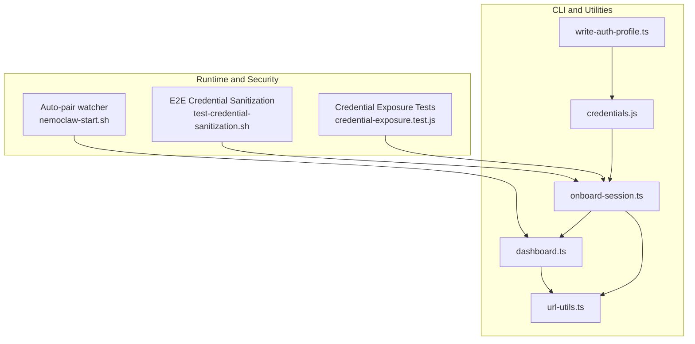
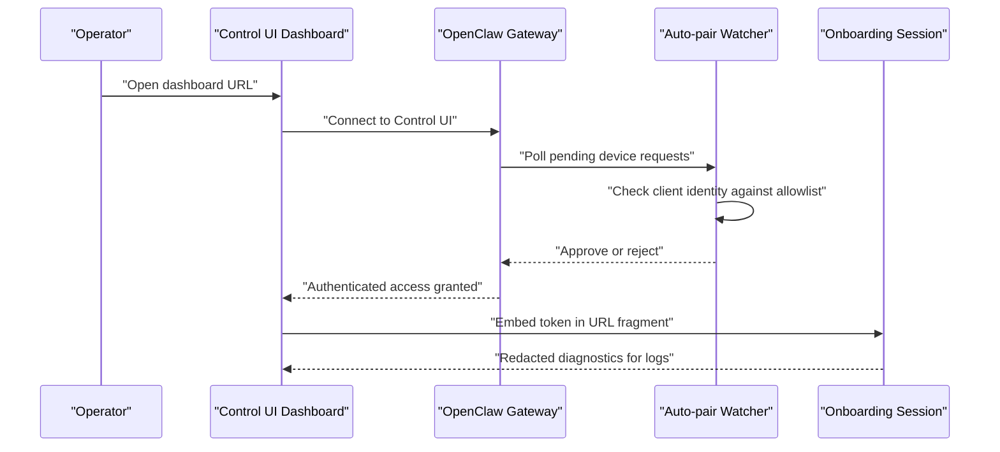
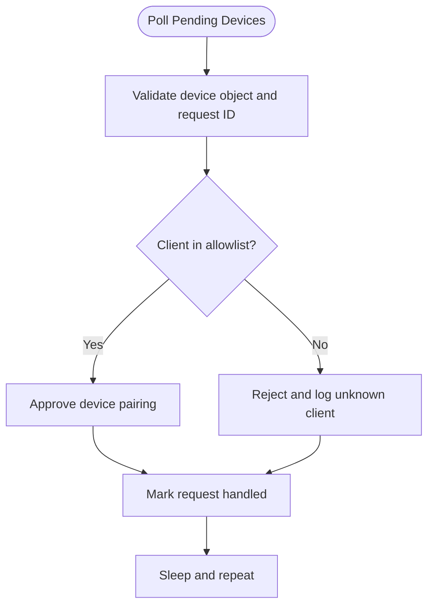
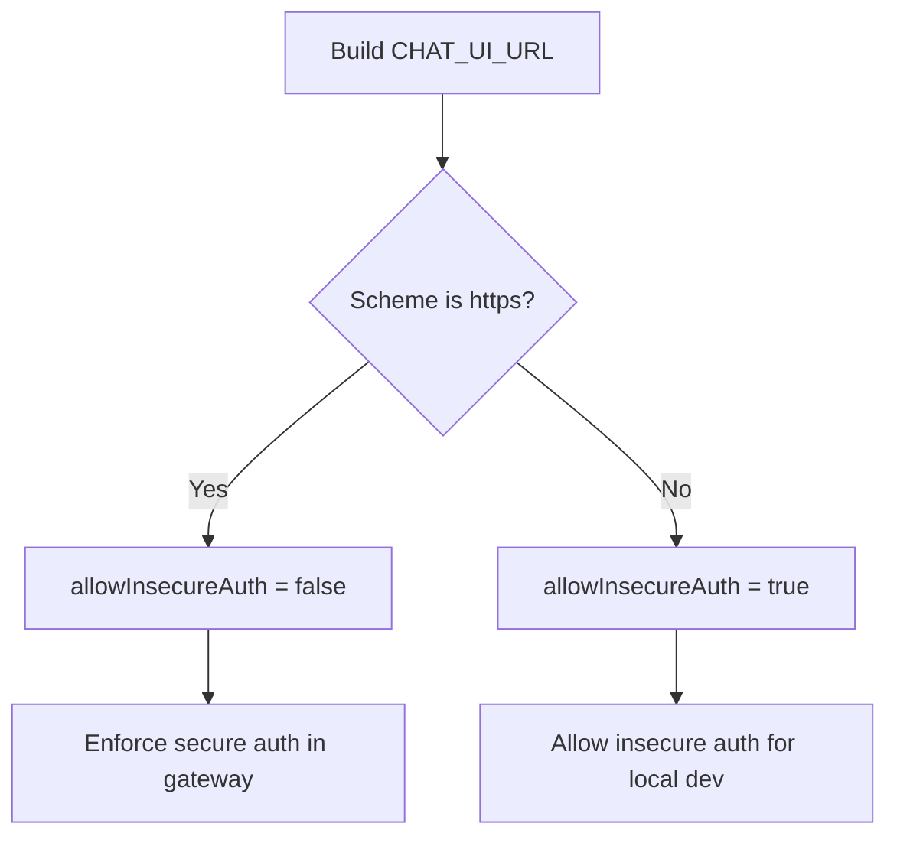
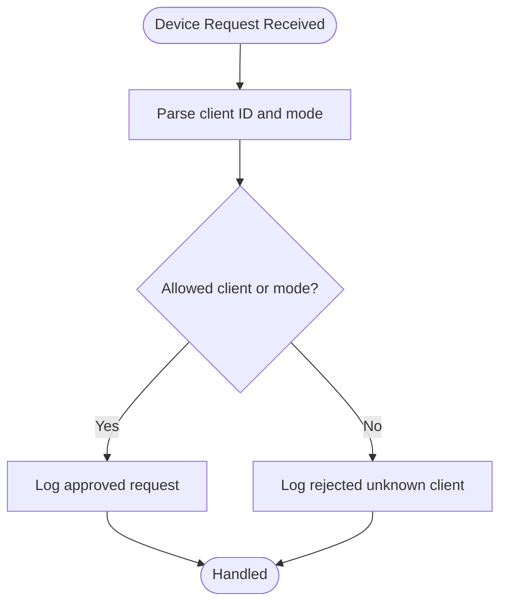
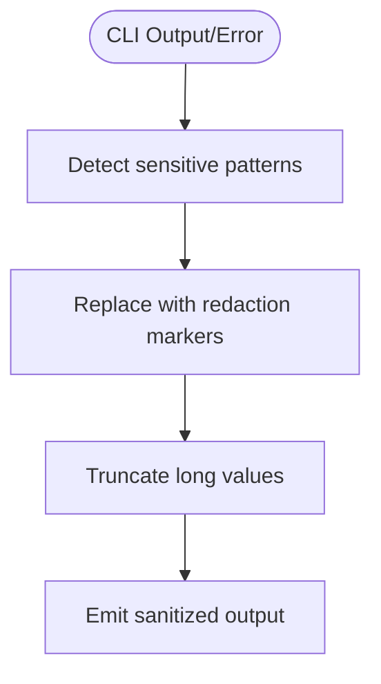
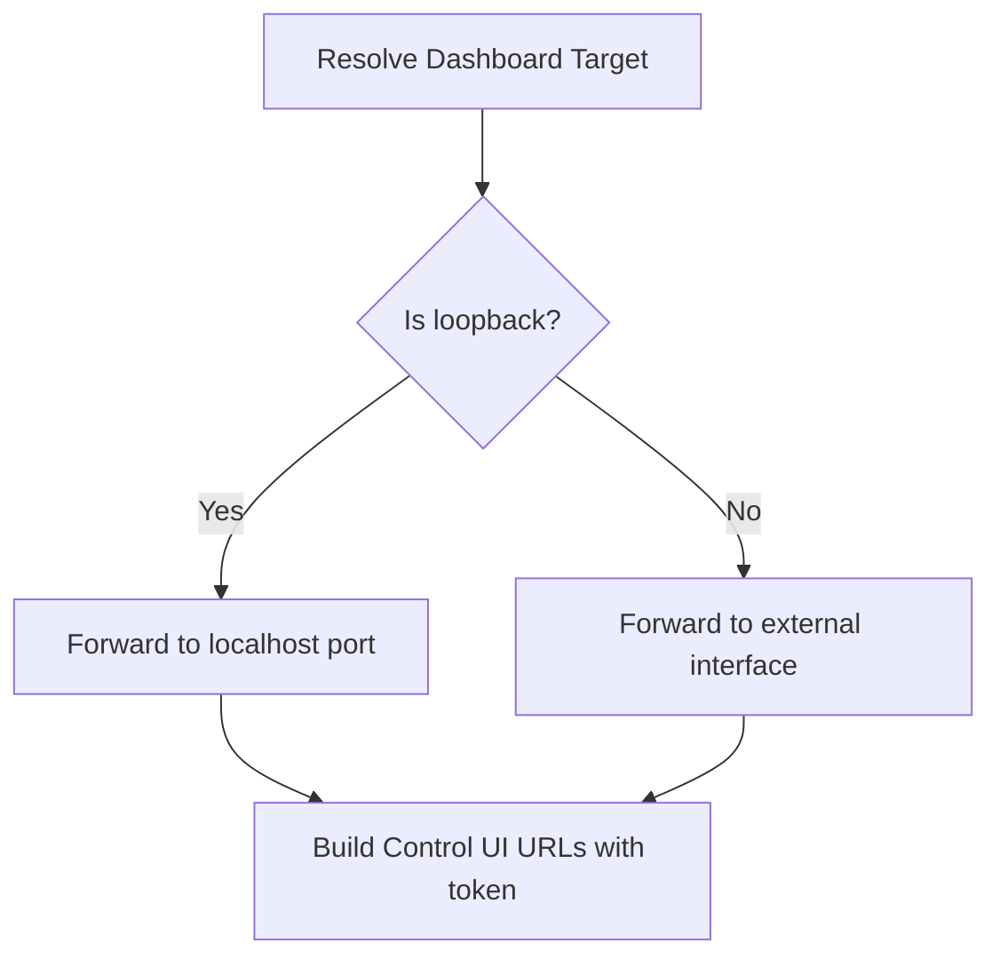
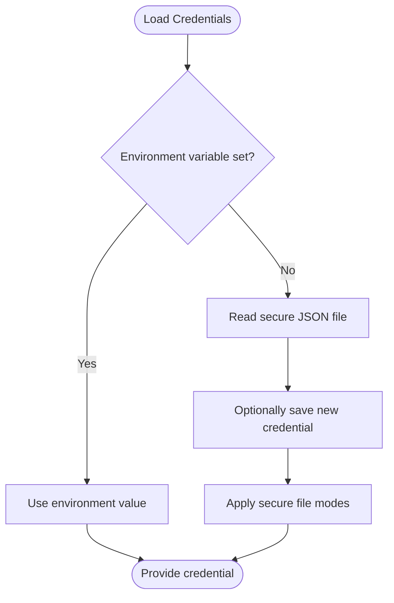
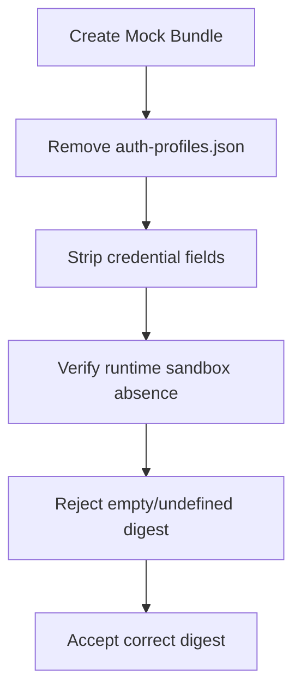
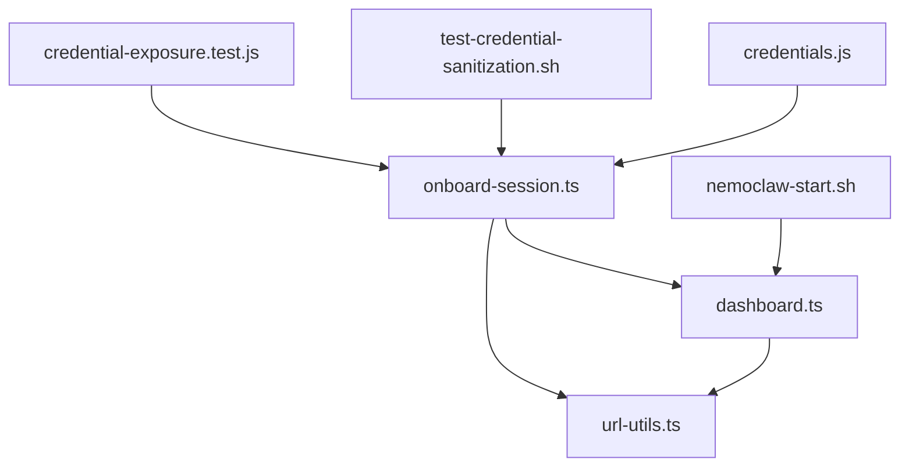

# Gateway Authentication

<cite>
**Referenced Files in This Document**
- [dashboard.ts](file://src/lib/dashboard.ts)
- [url-utils.ts](file://src/lib/url-utils.ts)
- [onboard-session.ts](file://src/lib/onboard-session.ts)
- [credentials.js](file://bin/lib/credentials.js)
- [write-auth-profile.ts](file://scripts/write-auth-profile.ts)
- [test-credential-sanitization.sh](file://test/e2e/test-credential-sanitization.sh)
- [credential-exposure.test.js](file://test/credential-exposure.test.js)
- [best-practices.md](file://docs/security/best-practices.md)
- [nemoclaw-start.sh](file://scripts/nemoclaw-start.sh)
</cite>

## Table of Contents
1. [Introduction](#introduction)
2. [Project Structure](#project-structure)
3. [Core Components](#core-components)
4. [Architecture Overview](#architecture-overview)
5. [Detailed Component Analysis](#detailed-component-analysis)
6. [Dependency Analysis](#dependency-analysis)
7. [Performance Considerations](#performance-considerations)
8. [Troubleshooting Guide](#troubleshooting-guide)
9. [Conclusion](#conclusion)

## Introduction
This document explains NemoClaw’s secure gateway access control mechanisms with a focus on device authentication, insecure auth derivation, auto-pair client allowlists, and CLI secret redaction. It documents the security architecture for controlling dashboard access, authentication token handling, and protection against credential exposure. Practical configuration examples and risk assessments are included for different deployment scenarios, along with best practices for secure gateway deployment.

## Project Structure
The gateway authentication subsystem spans several modules:
- Dashboard URL resolution and token embedding for the Control UI
- URL parsing and loopback detection for secure forwarding
- Onboarding session management with secret redaction and sanitization
- Credentials storage and retrieval with secure file modes
- E2E tests validating credential stripping and blueprint digest verification
- Auto-pair device allowlisting in the entrypoint script
- Build-time insecure auth derivation based on CHAT_UI_URL

**Diagram sources**
- [dashboard.ts:13-39](file://src/lib/dashboard.ts#L13-L39)
- [url-utils.ts:46-54](file://src/lib/url-utils.ts#L46-L54)
- [onboard-session.ts:122-171](file://src/lib/onboard-session.ts#L122-L171)
- [credentials.js:58-91](file://bin/lib/credentials.js#L58-L91)
- [write-auth-profile.ts:9-22](file://scripts/write-auth-profile.ts#L9-L22)
- [nemoclaw-start.sh:214-253](file://scripts/nemoclaw-start.sh#L214-L253)
- [test-credential-sanitization.sh:226-290](file://test/e2e/test-credential-sanitization.sh#L226-L290)
- [credential-exposure.test.js:26-80](file://test/credential-exposure.test.js#L26-L80)

**Section sources**
- [dashboard.ts:13-39](file://src/lib/dashboard.ts#L13-L39)
- [url-utils.ts:46-54](file://src/lib/url-utils.ts#L46-L54)
- [onboard-session.ts:122-171](file://src/lib/onboard-session.ts#L122-L171)
- [credentials.js:58-91](file://bin/lib/credentials.js#L58-L91)
- [write-auth-profile.ts:9-22](file://scripts/write-auth-profile.ts#L9-L22)
- [nemoclaw-start.sh:214-253](file://scripts/nemoclaw-start.sh#L214-L253)
- [test-credential-sanitization.sh:226-290](file://test/e2e/test-credential-sanitization.sh#L226-L290)
- [credential-exposure.test.js:26-80](file://test/credential-exposure.test.js#L26-L80)

## Core Components
- Dashboard URL resolution and token embedding: constructs URLs for the Control UI and injects session tokens safely.
- Loopback detection: determines whether to forward to localhost or external interfaces based on hostname.
- Onboarding session redaction: redacts sensitive patterns from URLs, errors, and diagnostics.
- Credentials storage: persists secrets securely under a protected directory with strict file modes.
- Auto-pair allowlist: approves known clients automatically and rejects unknown ones with logs.
- Insecure auth derivation: toggles allowInsecureAuth based on CHAT_UI_URL scheme at build time.
- CLI secret redaction: sanitizes output and error messages to prevent credential exposure.

**Section sources**
- [dashboard.ts:13-39](file://src/lib/dashboard.ts#L13-L39)
- [url-utils.ts:46-54](file://src/lib/url-utils.ts#L46-L54)
- [onboard-session.ts:122-171](file://src/lib/onboard-session.ts#L122-L171)
- [credentials.js:58-91](file://bin/lib/credentials.js#L58-L91)
- [nemoclaw-start.sh:214-253](file://scripts/nemoclaw-start.sh#L214-L253)
- [best-practices.md:379-410](file://docs/security/best-practices.md#L379-L410)

## Architecture Overview
The gateway authentication architecture integrates device pairing, dashboard access control, and secure credential handling:

**Diagram sources**
- [dashboard.ts:30-39](file://src/lib/dashboard.ts#L30-L39)
- [nemoclaw-start.sh:214-253](file://scripts/nemoclaw-start.sh#L214-L253)
- [onboard-session.ts:494-530](file://src/lib/onboard-session.ts#L494-L530)

## Detailed Component Analysis

### Device Authentication and Pairing
- Auto-pair watcher evaluates pending device requests and approves only known clients. Unknown clients are rejected and logged.
- The allowlist includes specific client identities and modes; the watcher tracks handled requests to avoid reprocessing.
- The entrypoint defines constants for allowed clients and modes outside the polling loop to ensure deterministic behavior.

**Diagram sources**
- [nemoclaw-start.sh:214-253](file://scripts/nemoclaw-start.sh#L214-L253)

**Section sources**
- [nemoclaw-start.sh:214-253](file://scripts/nemoclaw-start.sh#L214-L253)
- [best-practices.md:368-399](file://docs/security/best-practices.md#L368-L399)

### Insecure Auth Derivation Based on CHAT_UI_URL
- The allowInsecureAuth setting is derived from the CHAT_UI_URL scheme at build time.
- http:// allows insecure auth for local development; https:// blocks insecure auth for remote or production deployments.
- Relaxing this setting on HTTPS surfaces risks by transmitting tokens in cleartext.

**Diagram sources**
- [best-practices.md:379-388](file://docs/security/best-practices.md#L379-L388)

**Section sources**
- [best-practices.md:379-388](file://docs/security/best-practices.md#L379-L388)

### Auto-Pair Client Allowlist
- Default allowlist approves specific client identities and modes; all others are rejected and logged.
- The watcher maintains a set of handled request IDs to avoid reprocessing and reduce noise.
- If unexpected clients appear, investigate the source of the connection.

**Diagram sources**
- [nemoclaw-start.sh:214-253](file://scripts/nemoclaw-start.sh#L214-L253)
- [best-practices.md:390-399](file://docs/security/best-practices.md#L390-L399)

**Section sources**
- [nemoclaw-start.sh:214-253](file://scripts/nemoclaw-start.sh#L214-L253)
- [best-practices.md:390-399](file://docs/security/best-practices.md#L390-L399)

### CLI Secret Redaction for Output Protection
- The CLI redacts sensitive patterns (API keys, bearer tokens, provider credentials) from command output and error messages.
- Redaction applies to stdout, stderr, and thrown error messages; operators should verify shared debug output for residual secrets.

**Diagram sources**
- [onboard-session.ts:122-134](file://src/lib/onboard-session.ts#L122-L134)
- [best-practices.md:401-410](file://docs/security/best-practices.md#L401-L410)

**Section sources**
- [onboard-session.ts:122-134](file://src/lib/onboard-session.ts#L122-L134)
- [best-practices.md:401-410](file://docs/security/best-practices.md#L401-L410)

### Dashboard Access Control and Token Handling
- Dashboard URL resolution determines whether to forward to localhost or external interfaces based on loopback detection.
- Tokens are embedded in the URL fragment to avoid leaking to upstream servers.
- The Control UI is constructed from a base URL and optional CHAT_UI_URL.

**Diagram sources**
- [dashboard.ts:13-28](file://src/lib/dashboard.ts#L13-L28)
- [dashboard.ts:30-39](file://src/lib/dashboard.ts#L30-L39)
- [url-utils.ts:46-54](file://src/lib/url-utils.ts#L46-L54)

**Section sources**
- [dashboard.ts:13-28](file://src/lib/dashboard.ts#L13-L28)
- [dashboard.ts:30-39](file://src/lib/dashboard.ts#L30-L39)
- [url-utils.ts:46-54](file://src/lib/url-utils.ts#L46-L54)

### Credential Storage and Profiles
- Credentials are stored under a protected directory with strict file modes to prevent world-readable access.
- The CLI loads credentials from environment variables or a secure JSON file and supports interactive prompts for secrets.
- Auth profiles can be written to a secure location with restricted permissions.

**Diagram sources**
- [credentials.js:58-91](file://bin/lib/credentials.js#L58-L91)
- [credentials.js:217-256](file://bin/lib/credentials.js#L217-L256)
- [write-auth-profile.ts:9-22](file://scripts/write-auth-profile.ts#L9-L22)

**Section sources**
- [credentials.js:58-91](file://bin/lib/credentials.js#L58-L91)
- [credentials.js:217-256](file://bin/lib/credentials.js#L217-L256)
- [write-auth-profile.ts:9-22](file://scripts/write-auth-profile.ts#L9-L22)

### E2E Credential Sanitization and Blueprint Digest Verification
- E2E tests validate that migration bundles remove auth-profiles.json and sanitize credential fields in openclaw.json.
- Runtime checks ensure credentials are not accessible inside the sandbox.
- Blueprint digest verification rejects empty or missing digests to prevent bypasses.

**Diagram sources**
- [test-credential-sanitization.sh:226-290](file://test/e2e/test-credential-sanitization.sh#L226-L290)
- [test-credential-sanitization.sh:406-433](file://test/e2e/test-credential-sanitization.sh#L406-L433)
- [test-credential-sanitization.sh:502-612](file://test/e2e/test-credential-sanitization.sh#L502-L612)

**Section sources**
- [test-credential-sanitization.sh:226-290](file://test/e2e/test-credential-sanitization.sh#L226-L290)
- [test-credential-sanitization.sh:406-433](file://test/e2e/test-credential-sanitization.sh#L406-L433)
- [test-credential-sanitization.sh:502-612](file://test/e2e/test-credential-sanitization.sh#L502-L612)

### Credential Exposure Prevention in CLI Arguments
- Tests ensure that credential values are not passed directly as command-line arguments, avoiding exposure in process listings.
- The CLI uses environment variable names and avoids concatenating secrets into flags.

**Section sources**
- [credential-exposure.test.js:26-80](file://test/credential-exposure.test.js#L26-L80)

## Dependency Analysis
- Dashboard URL resolution depends on loopback detection to decide forwarding targets.
- Onboarding session redaction depends on URL parsing and pattern matching to sanitize sensitive data.
- Credentials storage relies on secure file modes and environment precedence.
- Auto-pair watcher depends on the entrypoint script’s allowlist constants and handled request tracking.
- E2E tests depend on the migration and sanitization logic to validate security controls.

**Diagram sources**
- [dashboard.ts:13-39](file://src/lib/dashboard.ts#L13-L39)
- [url-utils.ts:46-54](file://src/lib/url-utils.ts#L46-L54)
- [onboard-session.ts:122-171](file://src/lib/onboard-session.ts#L122-L171)
- [credentials.js:58-91](file://bin/lib/credentials.js#L58-L91)
- [nemoclaw-start.sh:214-253](file://scripts/nemoclaw-start.sh#L214-L253)
- [test-credential-sanitization.sh:226-290](file://test/e2e/test-credential-sanitization.sh#L226-L290)
- [credential-exposure.test.js:26-80](file://test/credential-exposure.test.js#L26-L80)

**Section sources**
- [dashboard.ts:13-39](file://src/lib/dashboard.ts#L13-L39)
- [url-utils.ts:46-54](file://src/lib/url-utils.ts#L46-L54)
- [onboard-session.ts:122-171](file://src/lib/onboard-session.ts#L122-L171)
- [credentials.js:58-91](file://bin/lib/credentials.js#L58-L91)
- [nemoclaw-start.sh:214-253](file://scripts/nemoclaw-start.sh#L214-L253)
- [test-credential-sanitization.sh:226-290](file://test/e2e/test-credential-sanitization.sh#L226-L290)
- [credential-exposure.test.js:26-80](file://test/credential-exposure.test.js#L26-L80)

## Performance Considerations
- Auto-pair polling runs at short intervals; ensure the watcher avoids unnecessary work by tracking handled requests.
- URL parsing and redaction are lightweight; however, excessive logging of rejected clients can increase I/O overhead.
- Secure file operations (mode changes, permission enforcement) are infrequent and bounded by onboarding and credential operations.

## Troubleshooting Guide
- Unexpected client rejections: Investigate logs for “rejected unknown client” entries and verify the client identity and mode.
- Dashboard access issues: Confirm loopback detection and forwarding behavior; ensure tokens are embedded in the URL fragment.
- Credential exposure concerns: Verify CLI redaction is enabled and inspect debug output for residual secrets.
- E2E failures: Validate that auth-profiles.json is removed and credential fields are sanitized in migration bundles; confirm runtime sandbox checks.

**Section sources**
- [nemoclaw-start.sh:214-253](file://scripts/nemoclaw-start.sh#L214-L253)
- [dashboard.ts:13-39](file://src/lib/dashboard.ts#L13-L39)
- [onboard-session.ts:122-171](file://src/lib/onboard-session.ts#L122-L171)
- [test-credential-sanitization.sh:226-290](file://test/e2e/test-credential-sanitization.sh#L226-L290)

## Conclusion
NemoClaw’s gateway authentication combines device pairing controls, secure dashboard access, and robust secret protection. Build-time insecure auth derivation, auto-pair allowlists, and CLI redaction collectively mitigate credential exposure and authentication bypasses. Adhering to recommended configurations and operational practices ensures secure deployment across local and remote environments.