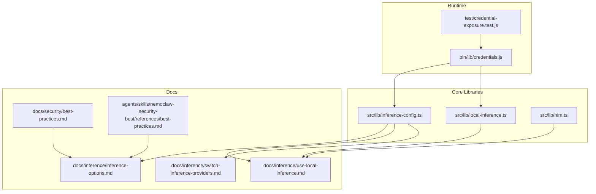
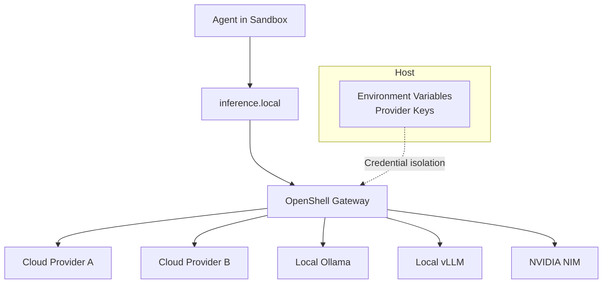
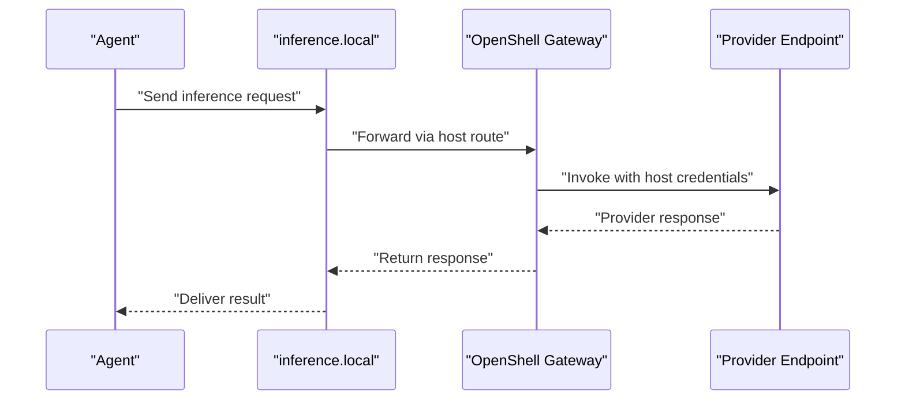
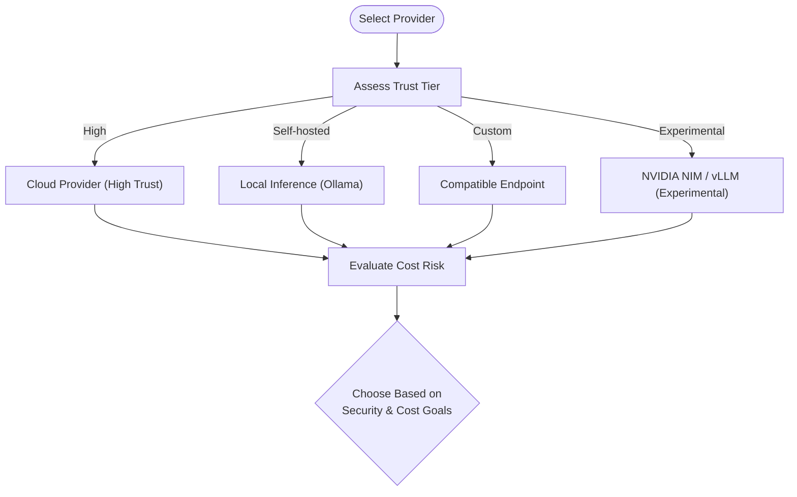
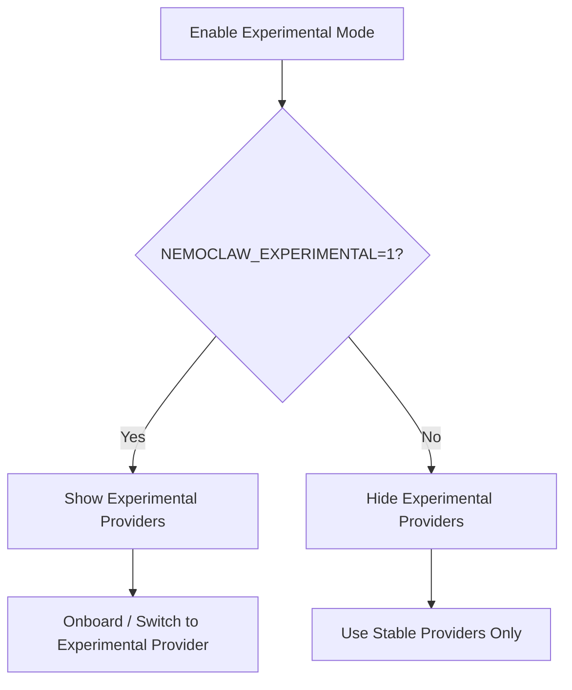
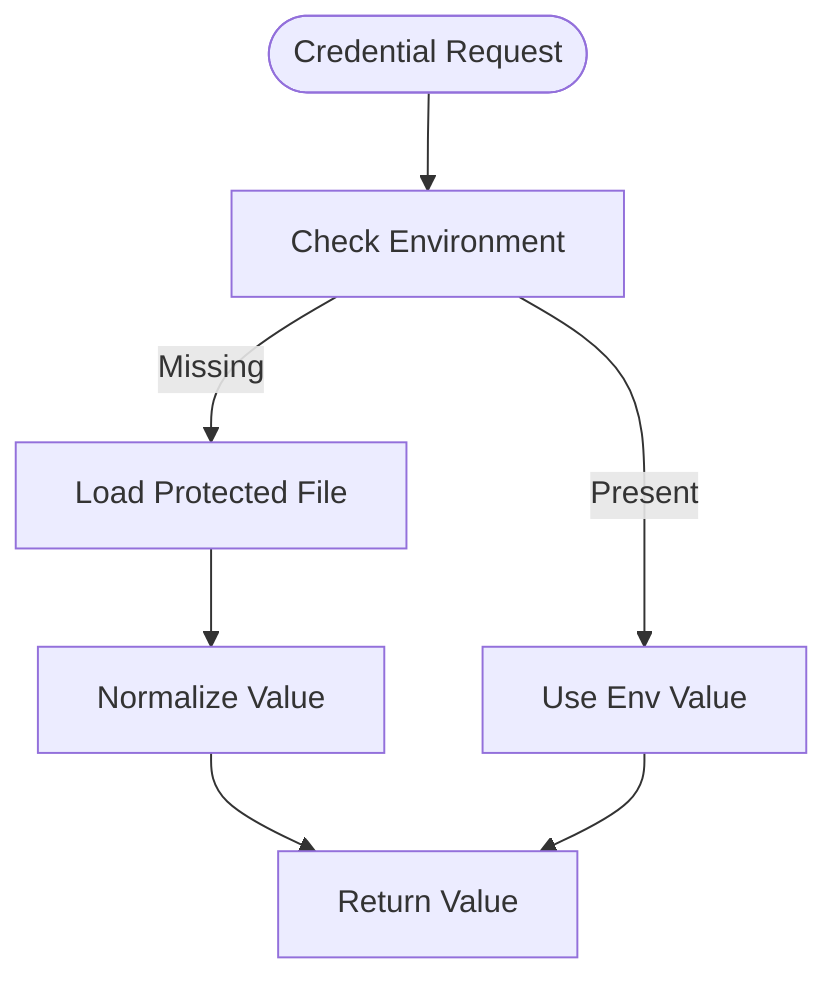
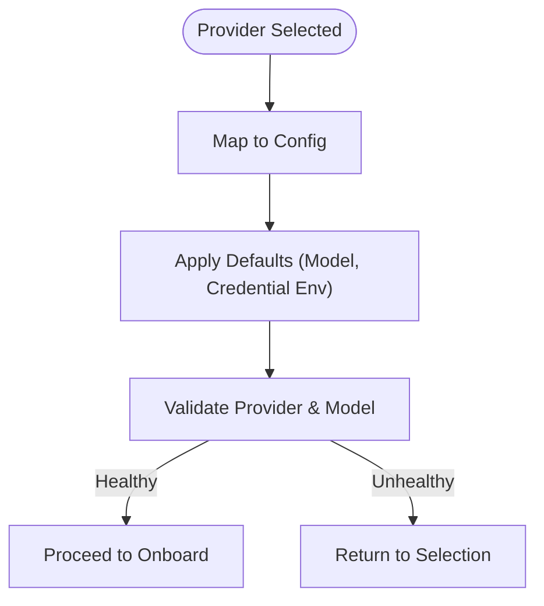
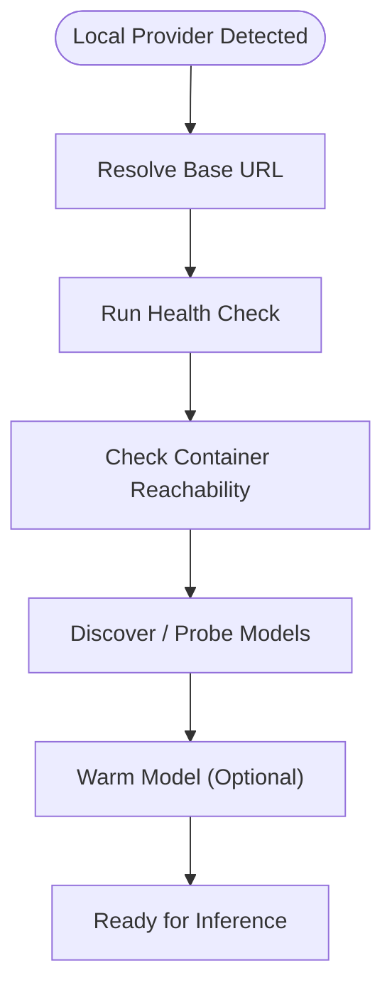
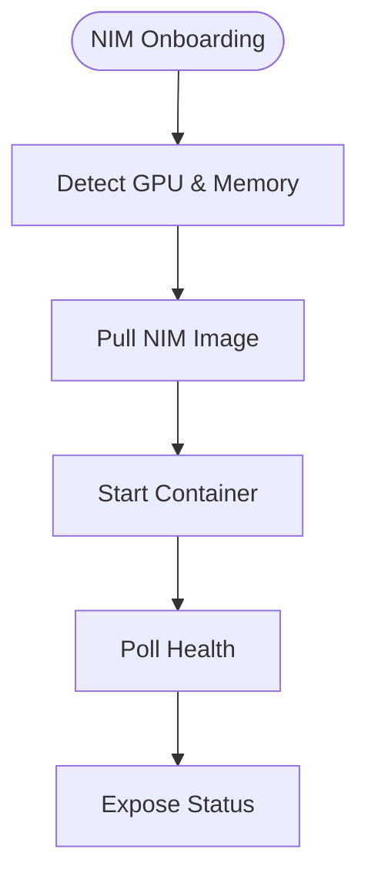
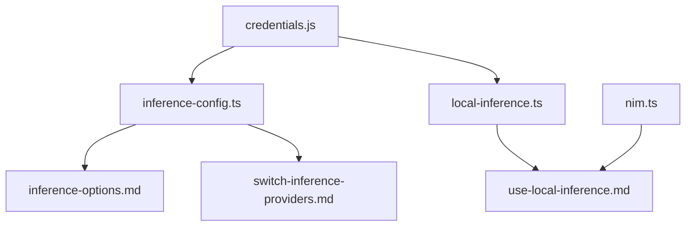

# Inference Controls

<cite>
**Referenced Files in This Document**
- [inference-config.ts](file://src/lib/inference-config.ts)
- [local-inference.ts](file://src/lib/local-inference.ts)
- [nim.ts](file://src/lib/nim.ts)
- [inference-options.md](file://docs/inference/inference-options.md)
- [use-local-inference.md](file://docs/inference/use-local-inference.md)
- [switch-inference-providers.md](file://docs/inference/switch-inference-providers.md)
- [best-practices.md](file://docs/security/best-practices.md)
- [best-practices.md](file://.agents/skills/nemoclaw-security-best/references/best-practices.md)
- [credentials.js](file://bin/lib/credentials.js)
- [credential-exposure.test.js](file://test/credential-exposure.test.js)
- [e2e-cloud-experimental/skip/04-nemoclaw-openshell-status-parity.sh](file://test/e2e/e2e-cloud-experimental/skip/04-nemoclaw-openshell-status-parity.sh)
- [test-e2e-cloud-experimental.sh](file://test/test-e2e-cloud-experimental.sh)
</cite>

## Table of Contents
1. [Introduction](#introduction)
2. [Project Structure](#project-structure)
3. [Core Components](#core-components)
4. [Architecture Overview](#architecture-overview)
5. [Detailed Component Analysis](#detailed-component-analysis)
6. [Dependency Analysis](#dependency-analysis)
7. [Performance Considerations](#performance-considerations)
8. [Troubleshooting Guide](#troubleshooting-guide)
9. [Conclusion](#conclusion)
10. [Appendices](#appendices)

## Introduction
This document focuses on NemoClaw’s inference controls with emphasis on secure inference architecture and provider management. It explains routed inference through the inference.local gateway, provider trust tiers, experimental provider gating, and credential isolation. It also covers security benefits of gateway-mediated inference, provider selection criteria, cost control mechanisms, and data handling considerations. Practical examples demonstrate configuring inference providers, implementing trust-based selection, managing credential isolation, and evaluating provider security profiles. Finally, it addresses security implications of different provider choices, cost control strategies, and best practices for inference security across deployment scenarios.

## Project Structure
NemoClaw organizes inference-related logic primarily under src/lib and documents provider options, local inference setup, and runtime switching in docs/inference. Security guidance and trust tiers are documented in docs/security and .agents/skills. Credential handling and exposure prevention are implemented in bin/lib/credentials.js and validated by tests.

**Diagram sources**
- [inference-config.ts:1-150](file://src/lib/inference-config.ts#L1-L150)
- [local-inference.ts:1-238](file://src/lib/local-inference.ts#L1-L238)
- [nim.ts:1-276](file://src/lib/nim.ts#L1-L276)
- [inference-options.md:1-81](file://docs/inference/inference-options.md#L1-L81)
- [use-local-inference.md:1-232](file://docs/inference/use-local-inference.md#L1-L232)
- [switch-inference-providers.md:1-101](file://docs/inference/switch-inference-providers.md#L1-L101)
- [best-practices.md:412-445](file://docs/security/best-practices.md#L412-L445)
- [best-practices.md:394-441](file://.agents/skills/nemoclaw-security-best/references/best-practices.md#L394-L441)
- [credentials.js:1-328](file://bin/lib/credentials.js#L1-L328)
- [credential-exposure.test.js:1-24](file://test/credential-exposure.test.js#L1-L24)

**Section sources**
- [inference-config.ts:1-150](file://src/lib/inference-config.ts#L1-L150)
- [local-inference.ts:1-238](file://src/lib/local-inference.ts#L1-L238)
- [nim.ts:1-276](file://src/lib/nim.ts#L1-L276)
- [inference-options.md:1-81](file://docs/inference/inference-options.md#L1-L81)
- [use-local-inference.md:1-232](file://docs/inference/use-local-inference.md#L1-L232)
- [switch-inference-providers.md:1-101](file://docs/inference/switch-inference-providers.md#L1-L101)
- [best-practices.md:412-445](file://docs/security/best-practices.md#L412-L445)
- [best-practices.md:394-441](file://.agents/skills/nemoclaw-security-best/references/best-practices.md#L394-L441)
- [credentials.js:1-328](file://bin/lib/credentials.js#L1-L328)
- [credential-exposure.test.js:1-24](file://test/credential-exposure.test.js#L1-L24)

## Core Components
- Inference routing and provider selection: Centralized provider mapping and default route configuration define how the agent communicates with inference providers via inference.local.
- Local inference helpers: Utilities for local providers (Ollama, vLLM) including health checks, model discovery, and container reachability validation.
- NVIDIA NIM management: GPU detection, image pulling, container orchestration, and health checks for local NVIDIA NIM.
- Documentation-driven provider options: Onboarding and runtime switching workflows, including experimental gating and validation.
- Security and credential isolation: Gateway-mediated routing, trust tiers, and credential storage/exposure prevention.

**Section sources**
- [inference-config.ts:12-121](file://src/lib/inference-config.ts#L12-L121)
- [local-inference.ts:29-130](file://src/lib/local-inference.ts#L29-L130)
- [nim.ts:59-275](file://src/lib/nim.ts#L59-L275)
- [inference-options.md:29-76](file://docs/inference/inference-options.md#L29-L76)
- [use-local-inference.md:28-232](file://docs/inference/use-local-inference.md#L28-L232)
- [best-practices.md:412-445](file://docs/security/best-practices.md#L412-L445)

## Architecture Overview
NemoClaw enforces a strict gateway-mediated inference architecture:
- Agent → inference.local (host-controlled route)
- OpenShell gateway intercepts and forwards to the selected provider
- Credentials remain on the host; sandbox does not receive keys
- Provider trust tiers guide selection for risk and cost control

**Diagram sources**
- [inference-options.md:29-36](file://docs/inference/inference-options.md#L29-L36)
- [best-practices.md:416-426](file://docs/security/best-practices.md#L416-L426)
- [inference-config.ts:42-115](file://src/lib/inference-config.ts#L42-L115)

**Section sources**
- [inference-options.md:29-36](file://docs/inference/inference-options.md#L29-L36)
- [best-practices.md:416-426](file://docs/security/best-practices.md#L416-L426)
- [inference-config.ts:42-115](file://src/lib/inference-config.ts#L42-L115)

## Detailed Component Analysis

### Secure Inference Routing through inference.local
- The agent always targets inference.local; OpenShell mediates routing to the chosen provider.
- Credentials are stored in environment variables on the host; the sandbox never receives them.
- Bypassing the gateway increases risk: direct provider endpoints could be exposed in network policies, potentially allowing the sandbox to use stolen or hardcoded keys.

**Diagram sources**
- [inference-options.md:29-36](file://docs/inference/inference-options.md#L29-L36)
- [best-practices.md:416-426](file://docs/security/best-practices.md#L416-L426)

**Section sources**
- [inference-options.md:29-36](file://docs/inference/inference-options.md#L29-L36)
- [best-practices.md:416-426](file://docs/security/best-practices.md#L416-L426)

### Provider Trust Tiers and Selection Criteria
Trust tiers and cost-risk profiles inform provider selection:
- High-trust cloud providers (NVIDIA Endpoints, OpenAI, Anthropic, Google Gemini)
- Self-hosted local inference (Ollama) with no egress costs
- Custom compatible endpoints (trust depends on operator)
- Experimental local NVIDIA NIM and vLLM gated by NEMOCLAW_EXPERIMENTAL

**Diagram sources**
- [best-practices.md:428-441](file://docs/security/best-practices.md#L428-L441)
- [best-practices.md:406-419](file://.agents/skills/nemoclaw-security-best/references/best-practices.md#L406-L419)
- [inference-options.md:44-63](file://docs/inference/inference-options.md#L44-L63)

**Section sources**
- [best-practices.md:428-441](file://docs/security/best-practices.md#L428-L441)
- [best-practices.md:406-419](file://.agents/skills/nemoclaw-security-best/references/best-practices.md#L406-L419)
- [inference-options.md:44-63](file://docs/inference/inference-options.md#L44-L63)

### Experimental Provider Gating with NEMOCLAW_EXPERIMENTAL
- Experimental local providers (NVIDIA NIM and local vLLM) require NEMOCLAW_EXPERIMENTAL=1.
- E2E tests enforce non-interactive gating and acceptance flags for experimental flows.
- Onboarding and runtime switching support experimental providers when enabled.

**Diagram sources**
- [use-local-inference.md:147-203](file://docs/inference/use-local-inference.md#L147-L203)
- [inference-options.md:54-63](file://docs/inference/inference-options.md#L54-L63)
- [test-e2e-cloud-experimental.sh:271-291](file://test/test-e2e-cloud-experimental.sh#L271-L291)
- [e2e-cloud-experimental/skip/04-nemoclaw-openshell-status-parity.sh:79-94](file://test/e2e/e2e-cloud-experimental/skip/04-nemoclaw-openshell-status-parity.sh#L79-L94)

**Section sources**
- [use-local-inference.md:147-203](file://docs/inference/use-local-inference.md#L147-L203)
- [inference-options.md:54-63](file://docs/inference/inference-options.md#L54-L63)
- [test-e2e-cloud-experimental.sh:271-291](file://test/test-e2e-cloud-experimental.sh#L271-L291)
- [e2e-cloud-experimental/skip/04-nemoclaw-openshell-status-parity.sh:79-94](file://test/e2e/e2e-cloud-experimental/skip/04-nemoclaw-openshell-status-parity.sh#L79-L94)

### Inference Credential Isolation
- Credentials are stored in a protected home-directory-backed file with restrictive permissions.
- The credential module normalizes values, persists securely, and avoids exposing secrets in logs or command-line arguments.
- Tests verify that credential values are not passed as literal values in CLI arguments.

**Diagram sources**
- [credentials.js:58-91](file://bin/lib/credentials.js#L58-L91)
- [credentials.js:75-84](file://bin/lib/credentials.js#L75-L84)
- [credential-exposure.test.js:17-24](file://test/credential-exposure.test.js#L17-L24)

**Section sources**
- [credentials.js:58-91](file://bin/lib/credentials.js#L58-L91)
- [credentials.js:75-84](file://bin/lib/credentials.js#L75-L84)
- [credential-exposure.test.js:1-24](file://test/credential-exposure.test.js#L1-L24)

### Provider Selection and Validation
- Provider selection maps a provider identifier to endpoint type, URL, model defaults, credential environment variable, and label.
- Validation ensures the selected provider and model are reachable and healthy before onboarding proceeds.
- For compatible endpoints, validation sends a real inference request when model endpoints are not available.

**Diagram sources**
- [inference-config.ts:42-115](file://src/lib/inference-config.ts#L42-L115)
- [inference-options.md:65-76](file://docs/inference/inference-options.md#L65-L76)

**Section sources**
- [inference-config.ts:42-115](file://src/lib/inference-config.ts#L42-L115)
- [inference-options.md:65-76](file://docs/inference/inference-options.md#L65-L76)

### Local Inference Management (Ollama, vLLM)
- Local provider base URLs and health checks are derived from provider identifiers.
- Container reachability validation ensures the sandbox can reach host-bound services.
- Ollama model discovery and warm-up commands support reliable local inference.

**Diagram sources**
- [local-inference.ts:29-130](file://src/lib/local-inference.ts#L29-L130)
- [local-inference.ts:153-208](file://src/lib/local-inference.ts#L153-L208)

**Section sources**
- [local-inference.ts:29-130](file://src/lib/local-inference.ts#L29-L130)
- [local-inference.ts:153-208](file://src/lib/local-inference.ts#L153-L208)

### NVIDIA NIM Orchestration
- GPU detection determines NIM capability and minimum memory thresholds.
- Image lookup, container start, health polling, and lifecycle management are provided.
- Status queries support operational visibility.

**Diagram sources**
- [nim.ts:59-169](file://src/lib/nim.ts#L59-L169)
- [nim.ts:171-202](file://src/lib/nim.ts#L171-L202)
- [nim.ts:241-275](file://src/lib/nim.ts#L241-L275)

**Section sources**
- [nim.ts:59-169](file://src/lib/nim.ts#L59-L169)
- [nim.ts:171-202](file://src/lib/nim.ts#L171-L202)
- [nim.ts:241-275](file://src/lib/nim.ts#L241-L275)

### Practical Examples

#### Configure an Inference Provider
- Choose a provider during onboarding; the wizard presents curated options and handles validation.
- For compatible endpoints, supply base URL and model; for cloud providers, set the appropriate API key environment variable.

**Section sources**
- [inference-options.md:38-76](file://docs/inference/inference-options.md#L38-L76)
- [use-local-inference.md:85-145](file://docs/inference/use-local-inference.md#L85-L145)

#### Implement Trust-Based Provider Selection
- Select high-trust cloud providers for general use; prefer self-hosted local inference for sensitive workloads.
- Evaluate cost risks and data handling characteristics per trust tier.

**Section sources**
- [best-practices.md:428-441](file://docs/security/best-practices.md#L428-L441)
- [best-practices.md:406-419](file://.agents/skills/nemoclaw-security-best/references/best-practices.md#L406-L419)

#### Manage Credential Isolation
- Store credentials in the protected credentials file; avoid passing secrets in CLI arguments.
- Confirm that credential exposure tests pass and environment variables are used instead of literals.

**Section sources**
- [credentials.js:58-91](file://bin/lib/credentials.js#L58-L91)
- [credential-exposure.test.js:1-24](file://test/credential-exposure.test.js#L1-L24)

#### Evaluate Provider Security Profiles
- Use trust tiers and cost-risk guidance to assess providers.
- Prefer local inference for data-sensitive scenarios; review provider data policies for cloud options.

**Section sources**
- [best-practices.md:428-441](file://docs/security/best-practices.md#L428-L441)
- [best-practices.md:406-419](file://.agents/skills/nemoclaw-security-best/references/best-practices.md#L406-L419)

#### Switch Providers at Runtime
- Use OpenShell inference set to change provider and model without restarting the sandbox.
- Verify changes via nemoclaw status.

**Section sources**
- [switch-inference-providers.md:33-96](file://docs/inference/switch-inference-providers.md#L33-L96)
- [use-local-inference.md:204-226](file://docs/inference/use-local-inference.md#L204-L226)

## Dependency Analysis
- Provider selection depends on centralized configuration mapping and defaults.
- Local inference helpers depend on host gateway URLs and container reachability.
- NVIDIA NIM orchestration depends on GPU detection and image catalogs.
- Documentation drives onboarding UX and runtime switching.

**Diagram sources**
- [inference-config.ts:1-150](file://src/lib/inference-config.ts#L1-L150)
- [local-inference.ts:1-238](file://src/lib/local-inference.ts#L1-L238)
- [nim.ts:1-276](file://src/lib/nim.ts#L1-L276)
- [inference-options.md:1-81](file://docs/inference/inference-options.md#L1-L81)
- [use-local-inference.md:1-232](file://docs/inference/use-local-inference.md#L1-L232)
- [switch-inference-providers.md:1-101](file://docs/inference/switch-inference-providers.md#L1-L101)
- [credentials.js:1-328](file://bin/lib/credentials.js#L1-L328)

**Section sources**
- [inference-config.ts:1-150](file://src/lib/inference-config.ts#L1-L150)
- [local-inference.ts:1-238](file://src/lib/local-inference.ts#L1-L238)
- [nim.ts:1-276](file://src/lib/nim.ts#L1-L276)
- [inference-options.md:1-81](file://docs/inference/inference-options.md#L1-L81)
- [use-local-inference.md:1-232](file://docs/inference/use-local-inference.md#L1-L232)
- [switch-inference-providers.md:1-101](file://docs/inference/switch-inference-providers.md#L1-L101)
- [credentials.js:1-328](file://bin/lib/credentials.js#L1-L328)

## Performance Considerations
- Local inference performance depends on model size and host GPU/CPU capacity; warm-up and probing help stabilize initial latency.
- Experimental providers (NIM, vLLM) introduce container startup and health-check overhead; enable only when necessary.
- Cost control favors local inference for sustained usage; cloud providers incur per-token charges.

[No sources needed since this section provides general guidance]

## Troubleshooting Guide
- Gateway-mediated inference failures: Verify that the agent communicates with inference.local and that the gateway is active.
- Local provider unreachability: Ensure local services listen on 0.0.0.0 for container reachability; confirm health checks succeed.
- Experimental provider gating: Enable NEMOCLAW_EXPERIMENTAL and meet prerequisites (GPU/memory) before selecting experimental providers.
- Credential exposure: Confirm that CLI arguments do not include literal credential values; rely on environment variables.

**Section sources**
- [best-practices.md:416-426](file://docs/security/best-practices.md#L416-L426)
- [local-inference.ts:73-130](file://src/lib/local-inference.ts#L73-L130)
- [use-local-inference.md:56-79](file://docs/inference/use-local-inference.md#L56-L79)
- [test-e2e-cloud-experimental.sh:271-291](file://test/test-e2e-cloud-experimental.sh#L271-L291)
- [credential-exposure.test.js:1-24](file://test/credential-exposure.test.js#L1-L24)

## Conclusion
NemoClaw’s inference controls center on a secure, gateway-mediated architecture that isolates provider credentials from the sandbox and enforces trust-based provider selection. Experimental gating enables controlled access to advanced local providers, while robust validation and credential isolation reduce risk. By aligning provider choice with trust and cost goals, teams can achieve strong security posture and predictable cost control across diverse deployment scenarios.

[No sources needed since this section summarizes without analyzing specific files]

## Appendices
- Provider trust tiers and cost-risk matrix are documented alongside best practices for inference security.
- Runtime switching and local inference setup are covered in dedicated documentation pages.

**Section sources**
- [best-practices.md:428-441](file://docs/security/best-practices.md#L428-L441)
- [best-practices.md:406-419](file://.agents/skills/nemoclaw-security-best/references/best-practices.md#L406-L419)
- [switch-inference-providers.md:1-101](file://docs/inference/switch-inference-providers.md#L1-L101)
- [use-local-inference.md:1-232](file://docs/inference/use-local-inference.md#L1-L232)