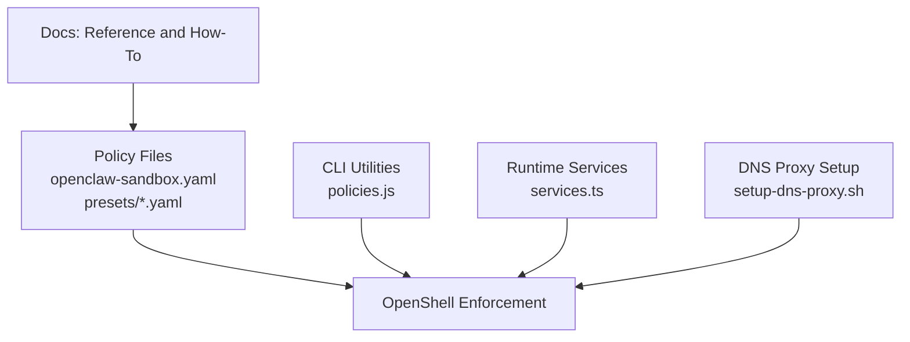
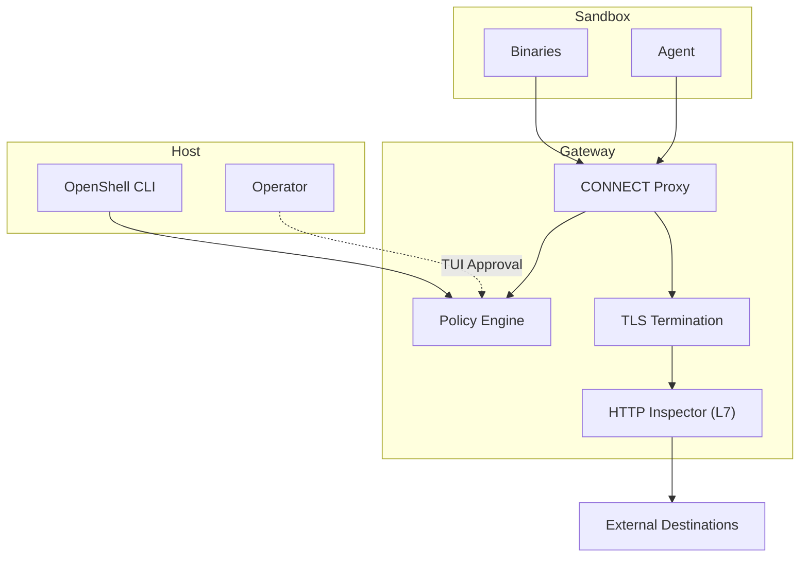
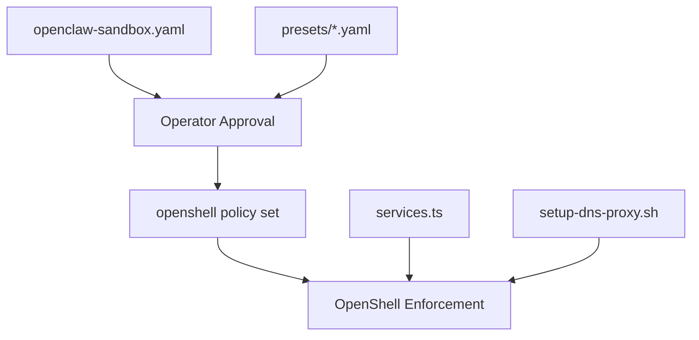

# Network Controls

<cite>
**Referenced Files in This Document**
- [network-policies.md](file://docs/reference/network-policies.md)
- [customize-network-policy.md](file://docs/network-policy/customize-network-policy.md)
- [approve-network-requests.md](file://docs/network-policy/approve-network-requests.md)
- [network-policies.md](file://docs/security/best-practices.md)
- [openclaw-sandbox.yaml](file://nemoclaw-blueprint/policies/openclaw-sandbox.yaml)
- [telegram.yaml](file://nemoclaw-blueprint/policies/presets/telegram.yaml)
- [npm.yaml](file://nemoclaw-blueprint/policies/presets/npm.yaml)
- [huggingface.yaml](file://nemoclaw-blueprint/policies/presets/huggingface.yaml)
- [policies.js](file://bin/lib/policies.js)
- [services.ts](file://src/lib/services.ts)
- [setup-dns-proxy.sh](file://scripts/setup-dns-proxy.sh)
</cite>

## Table of Contents
1. [Introduction](#introduction)
2. [Project Structure](#project-structure)
3. [Core Components](#core-components)
4. [Architecture Overview](#architecture-overview)
5. [Detailed Component Analysis](#detailed-component-analysis)
6. [Dependency Analysis](#dependency-analysis)
7. [Performance Considerations](#performance-considerations)
8. [Troubleshooting Guide](#troubleshooting-guide)
9. [Conclusion](#conclusion)
10. [Appendices](#appendices)

## Introduction
This document details NemoClaw’s multi-layered network security architecture with a focus on deny-by-default egress controls, binary-scoped endpoint rules using process tree analysis and SHA256 hashing, path-scoped HTTP rules with method and path restrictions, and L4-only versus L7 inspection mechanisms. It also covers the operator approval flow for dynamic policy updates, policy presets for common integrations, and the CONNECT proxy architecture. Practical examples demonstrate how to configure endpoint rules, implement binary restrictions, set up HTTP method controls, and manage the approval workflow. Finally, it addresses security implications, risk mitigation strategies, and best practices for development, testing, and production environments.

## Project Structure
NemoClaw’s network policy is defined in a declarative YAML file and enforced by NVIDIA OpenShell. Operators can:
- Modify the baseline policy statically by editing the policy file and re-running the onboard wizard.
- Apply dynamic updates to a running sandbox using the OpenShell CLI.
- Use predefined presets for common integrations.

**Diagram sources**
- [openclaw-sandbox.yaml](file://nemoclaw-blueprint/policies/openclaw-sandbox.yaml)
- [telegram.yaml](file://nemoclaw-blueprint/policies/presets/telegram.yaml)
- [npm.yaml](file://nemoclaw-blueprint/policies/presets/npm.yaml)
- [huggingface.yaml](file://nemoclaw-blueprint/policies/presets/huggingface.yaml)
- [policies.js](file://bin/lib/policies.js)
- [services.ts](file://src/lib/services.ts)
- [setup-dns-proxy.sh](file://scripts/setup-dns-proxy.sh)

**Section sources**
- [network-policies.md](file://docs/reference/network-policies.md)
- [customize-network-policy.md](file://docs/network-policy/customize-network-policy.md)
- [openclaw-sandbox.yaml](file://nemoclaw-blueprint/policies/openclaw-sandbox.yaml)

## Core Components
- Deny-by-default egress: All outbound connections are blocked unless explicitly allowed in the policy.
- Binary-scoped endpoint rules: Each endpoint restricts which executables can reach it; OpenShell validates the calling binary via process tree analysis and SHA256 hashing.
- Path-scoped HTTP rules: HTTP method and path restrictions are enforced for REST endpoints.
- L4-only vs L7 inspection: CONNECT proxy behavior controlled by the protocol field; L4-only relays TCP streams without payload inspection; L7 inspection enforces per-request HTTP rules.
- Operator approval flow: Real-time TUI prompts for unlisted destinations; approved endpoints persist for the session.
- Policy presets: Predefined YAML files for common integrations; can be applied to running sandboxes or merged into the baseline.
- CONNECT proxy architecture: All sandbox egress passes through the OpenShell gateway; TLS termination and inspection occur at the gateway.

**Section sources**
- [network-policies.md](file://docs/reference/network-policies.md)
- [network-policies.md](file://docs/security/best-practices.md)
- [openclaw-sandbox.yaml](file://nemoclaw-blueprint/policies/openclaw-sandbox.yaml)

## Architecture Overview
The network architecture enforces strict egress control at the gateway. The sandbox communicates with the outside world exclusively through the gateway, which enforces policy, performs TLS termination, and optionally inspects HTTP requests.

**Diagram sources**
- [network-policies.md](file://docs/reference/network-policies.md)
- [network-policies.md](file://docs/security/best-practices.md)
- [openclaw-sandbox.yaml](file://nemoclaw-blueprint/policies/openclaw-sandbox.yaml)

## Detailed Component Analysis

### Deny-by-Default Egress Controls
- Principle: Only endpoints listed in the baseline policy are allowed.
- Enforcement: OpenShell blocks unlisted destinations and logs attempts.
- Operator intervention: TUI displays blocked requests with host, port, and requesting binary; operator can approve or deny.

Practical example: To allow a new endpoint for a specific integration, either add it to the baseline policy file and re-run the onboard wizard, or apply a dynamic policy update to the running sandbox.

Security implications:
- Prevents accidental data exfiltration and unauthorized outbound connections.
- Minimizes blast radius by scoping access to specific hosts and binaries.

Risk mitigation:
- Prefer operator approval for one-off requests.
- Periodically review approved endpoints and reset policy by recreating the sandbox when necessary.

Best practices by scenario:
- Development: Apply presets for package registries and Docker; scope binaries and paths tightly.
- Testing: Add custom endpoints with L7 inspection and tight method/path rules; clean up after tests.
- Production: Keep default posture; require approvals for any new endpoints.

**Section sources**
- [network-policies.md](file://docs/reference/network-policies.md)
- [network-policies.md](file://docs/security/best-practices.md)
- [customize-network-policy.md](file://docs/network-policy/customize-network-policy.md)
- [approve-network-requests.md](file://docs/network-policy/approve-network-requests.md)

### Binary-Scoped Endpoint Rules (Process Tree + SHA256)
- Enforcement: OpenShell identifies the calling binary by reading the kernel-trusted executable path, walking the process tree, and computing a SHA256 hash on first use.
- Behavior: If a binary is replaced while the sandbox runs, a hash mismatch triggers an immediate deny.

Practical example: Configure an endpoint entry with a specific binary path or glob pattern to restrict access to intended executables.

Security implications:
- Prevents substitution attacks where a legitimate binary is replaced with a malicious one.
- Ensures only intended processes can reach designated endpoints.

Risk mitigation:
- Always scope endpoints to specific binaries.
- Avoid removing binary restrictions; add new binaries explicitly rather than broadening access.

Best practices:
- Use precise binary paths; wildcards are supported for component-level matching.
- Regularly audit approved binaries and their hashes.

**Section sources**
- [network-policies.md](file://docs/security/best-practices.md)
- [openclaw-sandbox.yaml](file://nemoclaw-blueprint/policies/openclaw-sandbox.yaml)

### Path-Scoped HTTP Rules (Methods and Paths)
- Enforcement: HTTP method and path restrictions are evaluated for REST endpoints.
- Defaults: Many endpoints allow GET and POST on all paths; some are read-only (GET only).
- Configuration: Add or restrict HTTP methods and paths to align with the agent’s operational needs.

Practical example: For read-only documentation, use GET-only rules; for write operations, add PUT/DELETE/PATCH and restrict to specific API routes.

Security implications:
- Limits agent capabilities to only what is necessary for the task.
- Prevents unintended deletions or modifications to external resources.

Risk mitigation:
- Use GET-only for read-only endpoints.
- Add write methods only when required and constrain paths to specific routes.

Best practices:
- Enable L7 inspection for REST APIs.
- Combine method and path restrictions for least privilege.

**Section sources**
- [network-policies.md](file://docs/security/best-practices.md)
- [openclaw-sandbox.yaml](file://nemoclaw-blueprint/policies/openclaw-sandbox.yaml)

### L4-Only vs L7 Inspection Mechanisms
- L4-only: CONNECT proxy inspects host, port, and binary identity; TCP stream relayed without payload inspection.
- L7 inspection: Enforced when protocol is set to REST; TLS is auto-detected and terminated; per-request HTTP method and path evaluation occurs.

Practical example: Use L7 inspection with explicit rules for REST APIs; use L4-only for non-HTTP protocols or when inspection is unnecessary.

Security implications:
- L4-only allows arbitrary payloads after initial connection; L7 inspection provides granular control.
- access: full with protocol: rest enables inspection but does not restrict methods/paths; use rules or access presets accordingly.

Risk mitigation:
- Prefer L7 inspection with specific rules for REST APIs.
- Use access: read-only for read-only endpoints.
- Avoid L4-only for HTTP APIs requiring method/path control.

Best practices:
- Set protocol: rest for REST APIs needing inspection.
- Use access presets (read-only/read-write/full) or explicit rules to define allowed methods and paths.

**Section sources**
- [network-policies.md](file://docs/security/best-practices.md)
- [openclaw-sandbox.yaml](file://nemoclaw-blueprint/policies/openclaw-sandbox.yaml)

### Operator Approval Flow for Dynamic Policy Updates
- Workflow: Agent attempts to reach an unlisted endpoint; OpenShell blocks and logs; TUI displays details; operator approves or denies; approved endpoint is added to the running policy for the session.
- Dynamic updates: Apply policy updates to a running sandbox without restarting using the OpenShell CLI.
- Scope: Dynamic changes apply only to the current session; baseline resets on sandbox recreation.

Practical example: Use openshell term to review blocked requests, approve endpoints for the session, and later apply a static change to the baseline policy.

Security implications:
- Real-time visibility and control over outbound connections.
- Approved endpoints persist within the session; baseline remains locked-down.

Risk mitigation:
- Review each approval carefully; prefer operator approval for one-off requests over permanent baseline changes.
- Reset policy by recreating the sandbox to clear approved endpoints.

**Section sources**
- [network-policies.md](file://docs/reference/network-policies.md)
- [approve-network-requests.md](file://docs/network-policy/approve-network-requests.md)
- [customize-network-policy.md](file://docs/network-policy/customize-network-policy.md)

### Policy Presets for Common Integrations
Presets provide preconfigured endpoint groups for common integrations. They can be applied to running sandboxes or merged into the baseline policy.

Examples:
- Telegram: Bot API with method/path restrictions scoped to Node binaries.
- npm: Registry access for npm, npx, node, yarn with wildcard binary patterns.
- Hugging Face: Hub, CDN, and Inference API with REST inspection and method/path allowances.

Practical example: Apply a preset to a running sandbox using the OpenShell CLI, or merge its entries into the baseline policy and re-run the onboard wizard.

Security implications:
- Presets broaden access; review YAML to understand endpoints, methods, and binary restrictions.
- Some presets allow broad GET access to CDNs or WebSocket gateways; assess risk accordingly.

Risk mitigation:
- Apply presets only when the agent’s task requires them.
- Audit and adjust presets to match least privilege requirements.

**Section sources**
- [customize-network-policy.md](file://docs/network-policy/customize-network-policy.md)
- [telegram.yaml](file://nemoclaw-blueprint/policies/presets/telegram.yaml)
- [npm.yaml](file://nemoclaw-blueprint/policies/presets/npm.yaml)
- [huggingface.yaml](file://nemoclaw-blueprint/policies/presets/huggingface.yaml)

### CONNECT Proxy Architecture
- All sandbox egress traverses the OpenShell gateway via a CONNECT proxy.
- TLS termination and inspection occur at the gateway; L7 inspection evaluates HTTP requests when enabled.
- DNS proxy setup allows sandbox namespace to reach the gateway for DNS queries.

Practical example: The sandbox’s DNS queries are routed through a pod-side forwarder and iptables rule to the gateway’s DNS proxy.

Security implications:
- Centralized control and auditing of outbound traffic.
- TLS termination at the gateway prevents plaintext transmission.

Risk mitigation:
- Ensure DNS proxy is correctly configured to allow UDP DNS to the gateway.
- Monitor CONNECT proxy logs and TUI for suspicious activity.

**Section sources**
- [network-policies.md](file://docs/security/best-practices.md)
- [setup-dns-proxy.sh](file://scripts/setup-dns-proxy.sh)

## Dependency Analysis
The network policy enforcement depends on:
- Policy definition files (baseline and presets).
- OpenShell CLI for dynamic policy updates and TUI.
- Runtime services for bridging and tunneling.
- DNS proxy scripts for sandbox connectivity.

**Diagram sources**
- [openclaw-sandbox.yaml](file://nemoclaw-blueprint/policies/openclaw-sandbox.yaml)
- [telegram.yaml](file://nemoclaw-blueprint/policies/presets/telegram.yaml)
- [npm.yaml](file://nemoclaw-blueprint/policies/presets/npm.yaml)
- [huggingface.yaml](file://nemoclaw-blueprint/policies/presets/huggingface.yaml)
- [policies.js](file://bin/lib/policies.js)
- [services.ts](file://src/lib/services.ts)
- [setup-dns-proxy.sh](file://scripts/setup-dns-proxy.sh)

**Section sources**
- [policies.js](file://bin/lib/policies.js)
- [services.ts](file://src/lib/services.ts)
- [setup-dns-proxy.sh](file://scripts/setup-dns-proxy.sh)

## Performance Considerations
- L7 inspection adds CPU overhead due to TLS termination and per-request evaluation; use selectively for REST APIs requiring method/path control.
- CONNECT proxy introduces minimal latency; ensure DNS proxy is configured to avoid delays.
- Operator approval flow is interactive; batch approvals for similar endpoints when appropriate.

## Troubleshooting Guide
Common issues and resolutions:
- Blocked requests: Use openshell term to review blocked requests and approve or deny as needed.
- Policy not applying: Verify the policy file format and use openshell policy set to apply dynamic updates; confirm the sandbox is running.
- DNS resolution failures: Confirm DNS proxy setup and iptables rules for UDP DNS to the gateway.
- Preset conflicts: Review preset YAML and adjust binary patterns or endpoint rules to avoid conflicts.

Operational tips:
- Use openshell term to monitor sandbox activity and TUI prompts.
- For remote sandboxes, SSH into the instance and run openshell term from the repository directory.
- After testing, reset approved endpoints by recreating the sandbox to restore the baseline policy.

**Section sources**
- [approve-network-requests.md](file://docs/network-policy/approve-network-requests.md)
- [customize-network-policy.md](file://docs/network-policy/customize-network-policy.md)
- [services.ts](file://src/lib/services.ts)
- [setup-dns-proxy.sh](file://scripts/setup-dns-proxy.sh)

## Conclusion
NemoClaw’s network controls implement a robust deny-by-default posture with strong enforcement at the gateway. Binary-scoped endpoint rules, path-scoped HTTP rules, and L4/L7 inspection mechanisms provide granular control over outbound traffic. The operator approval flow ensures visibility and governance for dynamic updates, while policy presets streamline common integrations. By following best practices—scoping binaries and paths, enabling L7 inspection for REST APIs, and using operator approvals judiciously—organizations can maintain strong security postures across development, testing, and production environments.

## Appendices

### Practical Examples

- Configure endpoint rules:
  - Add a new endpoint group to the baseline policy file with host, port, protocol, enforcement, TLS, and rules.
  - Re-run the onboard wizard to apply static changes, or use openshell policy set to apply dynamic updates.

- Implement binary restrictions:
  - Specify exact binary paths or glob patterns in the binaries field for each endpoint group.
  - Avoid removing binary restrictions; add new binaries explicitly.

- Set up HTTP method controls:
  - For REST endpoints, set protocol to REST and define rules with allowed methods and paths.
  - Use access presets (read-only/read-write/full) or explicit rules to control behavior.

- Manage the approval workflow:
  - Run openshell term to monitor blocked requests.
  - Approve endpoints for the session or add them to the baseline policy for future sessions.

**Section sources**
- [customize-network-policy.md](file://docs/network-policy/customize-network-policy.md)
- [openclaw-sandbox.yaml](file://nemoclaw-blueprint/policies/openclaw-sandbox.yaml)
- [approve-network-requests.md](file://docs/network-policy/approve-network-requests.md)