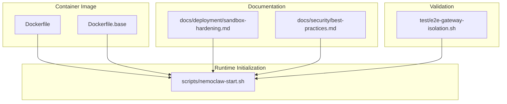
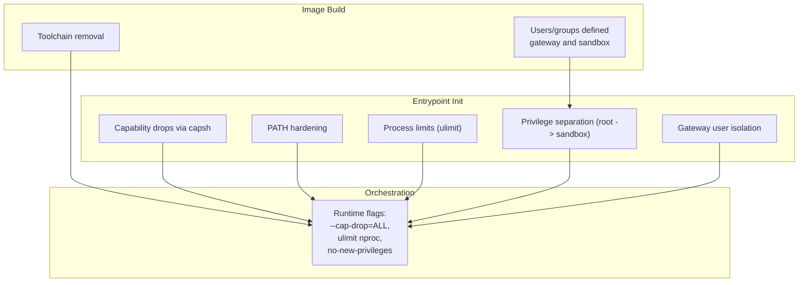
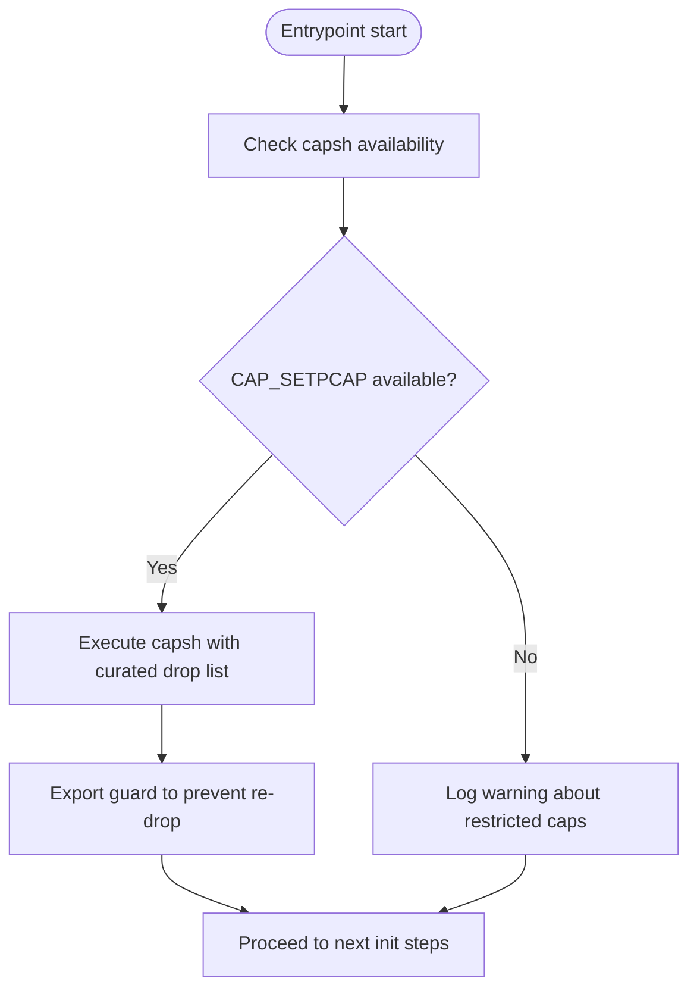
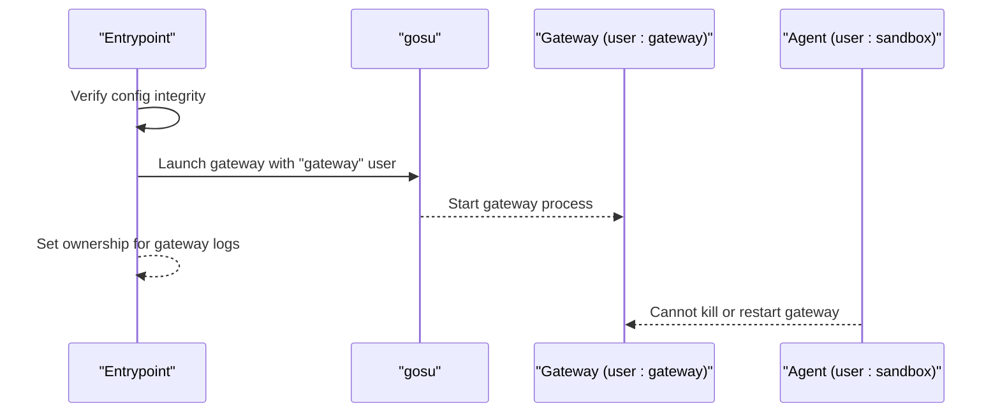
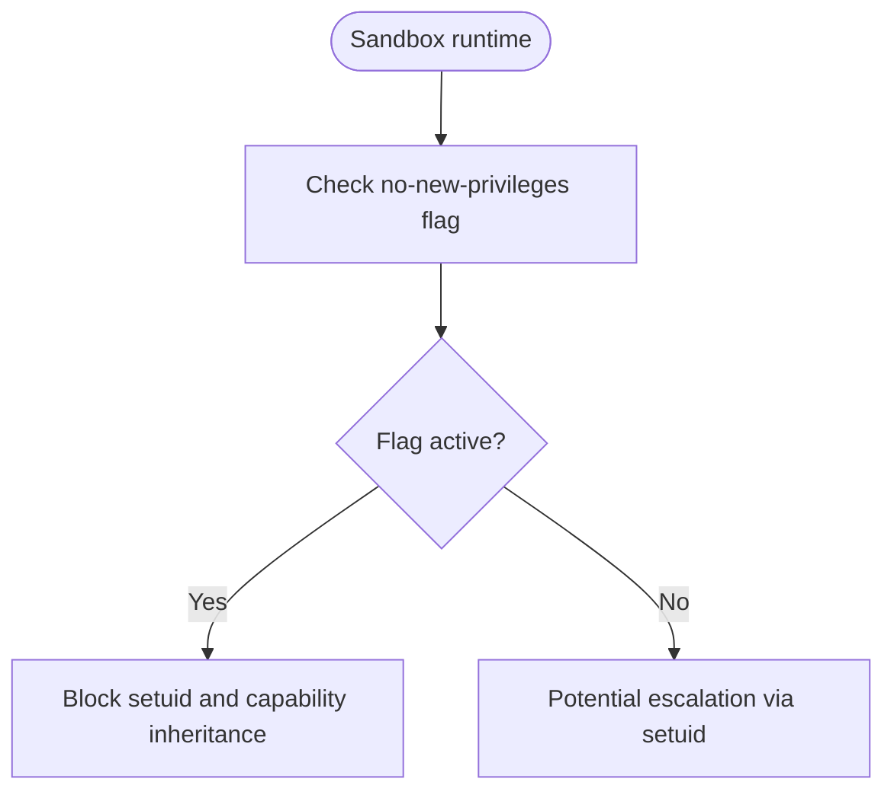
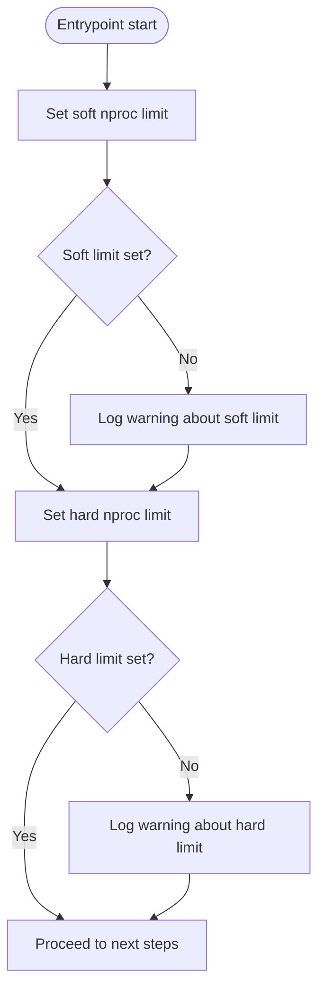
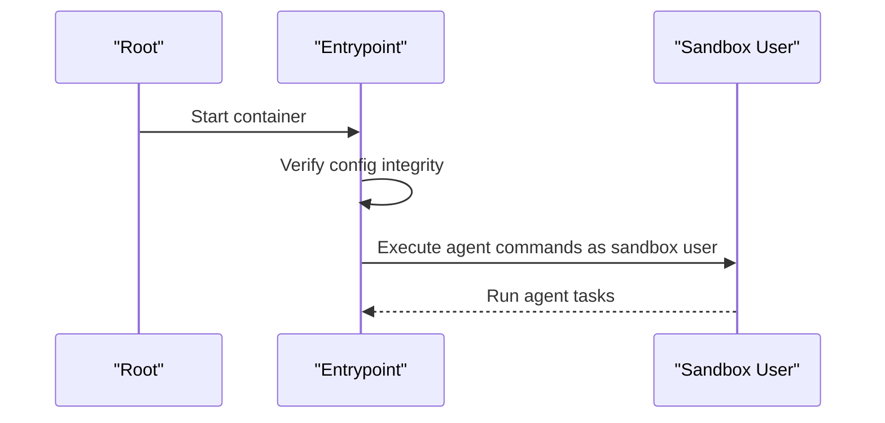
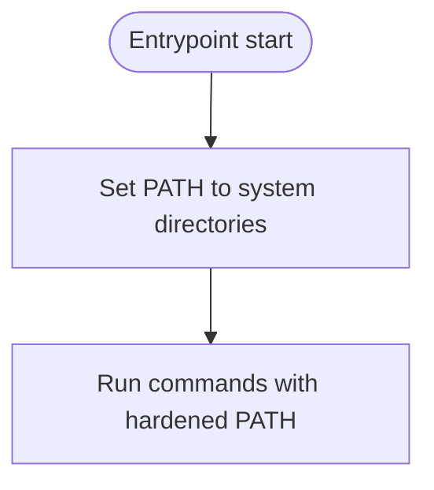
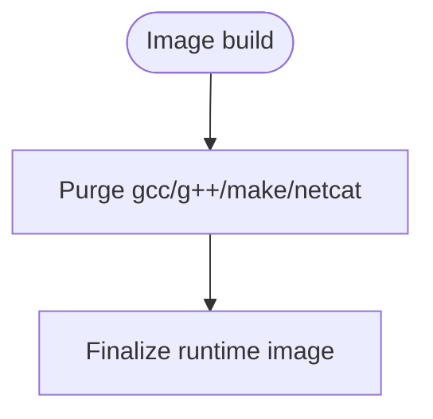
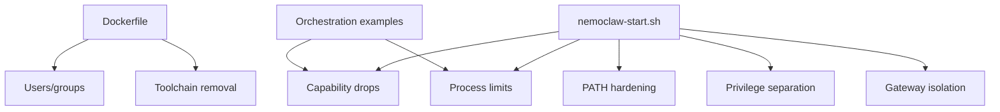

# Process Controls

<cite>
**Referenced Files in This Document**
- [nemoclaw-start.sh](file://scripts/nemoclaw-start.sh)
- [Dockerfile](file://Dockerfile)
- [Dockerfile.base](file://Dockerfile.base)
- [sandbox-hardening.md](file://docs/deployment/sandbox-hardening.md)
- [best-practices.md](file://docs/security/best-practices.md)
- [e2e-gateway-isolation.sh](file://test/e2e-gateway-isolation.sh)
</cite>

## Table of Contents
1. [Introduction](#introduction)
2. [Project Structure](#project-structure)
3. [Core Components](#core-components)
4. [Architecture Overview](#architecture-overview)
5. [Detailed Component Analysis](#detailed-component-analysis)
6. [Dependency Analysis](#dependency-analysis)
7. [Performance Considerations](#performance-considerations)
8. [Troubleshooting Guide](#troubleshooting-guide)
9. [Conclusion](#conclusion)

## Introduction
This document details NemoClaw’s process-level security architecture with a focus on process controls. It explains how the system enforces capability drops, gateway process isolation, no-new-privileges, process limits, non-root user execution, PATH hardening, and build toolchain removal. It also outlines the privilege separation mechanisms, security implications of each control, best practices for process isolation, and practical configuration guidance. The goal is to help operators configure and validate a hardened sandbox runtime that minimizes the blast radius of untrusted workloads.

## Project Structure
NemoClaw’s process controls are implemented across:
- The sandbox entrypoint script that initializes the runtime and enforces process-level hardening
- The sandbox image definition that removes unnecessary tooling and establishes users
- Deployment guidance that demonstrates runtime-level capability dropping and process limits
- Tests that validate capability drops and isolation behaviors

**Diagram sources**
- [Dockerfile:1-176](file://Dockerfile#L1-L176)
- [Dockerfile.base:1-124](file://Dockerfile.base#L1-L124)
- [nemoclaw-start.sh:1-436](file://scripts/nemoclaw-start.sh#L1-L436)
- [sandbox-hardening.md:1-91](file://docs/deployment/sandbox-hardening.md#L1-L91)
- [best-practices.md:269-362](file://docs/security/best-practices.md#L269-L362)
- [e2e-gateway-isolation.sh:190-221](file://test/e2e-gateway-isolation.sh#L190-L221)

**Section sources**
- [Dockerfile:1-176](file://Dockerfile#L1-L176)
- [Dockerfile.base:82-88](file://Dockerfile.base#L82-L88)
- [nemoclaw-start.sh:21-58](file://scripts/nemoclaw-start.sh#L21-L58)
- [sandbox-hardening.md:18-91](file://docs/deployment/sandbox-hardening.md#L18-L91)
- [best-practices.md:269-362](file://docs/security/best-practices.md#L269-L362)

## Core Components
- Capability drops using capsh: The entrypoint drops dangerous capabilities from the bounding set at startup to constrain child processes. It retains a minimal set required for privilege separation (e.g., chown/setuid/setgid/fowner/kill).
- Gateway process isolation: The gateway runs under a dedicated user separate from the sandbox user, preventing the agent from killing or restarting the gateway with tampered configuration.
- No-new-privileges: Enforced by the sandbox runtime to prevent escalation via setuid binaries or capability inheritance.
- Process limits: The entrypoint sets ulimit for user processes (soft/hard) to mitigate fork-bomb risks; best-effort depending on container runtime permissions.
- Non-root user execution: The sandbox runs agent commands under a dedicated sandbox user; the entrypoint starts as root for privilege separation, then drops to sandbox.
- PATH hardening: The entrypoint sets PATH to system directories only, preventing injection of malicious binaries.
- Build toolchain removal: The runtime image removes compilers and network probes to reduce attack surface.

**Section sources**
- [nemoclaw-start.sh:21-58](file://scripts/nemoclaw-start.sh#L21-L58)
- [nemoclaw-start.sh:33-33](file://scripts/nemoclaw-start.sh#L33-L33)
- [nemoclaw-start.sh:341-371](file://scripts/nemoclaw-start.sh#L341-L371)
- [nemoclaw-start.sh:422-428](file://scripts/nemoclaw-start.sh#L422-L428)
- [Dockerfile.base:82-88](file://Dockerfile.base#L82-L88)
- [Dockerfile:24-28](file://Dockerfile#L24-L28)
- [best-practices.md:276-362](file://docs/security/best-practices.md#L276-L362)

## Architecture Overview
The process controls are layered across image build, runtime initialization, and orchestration configuration. The entrypoint performs capability drops, PATH hardening, process limits, and privilege separation. The image defines users and removes build toolchains. Orchestration examples demonstrate runtime-level capability dropping and process limits.

**Diagram sources**
- [Dockerfile.base:82-88](file://Dockerfile.base#L82-L88)
- [Dockerfile:24-28](file://Dockerfile#L24-L28)
- [nemoclaw-start.sh:21-58](file://scripts/nemoclaw-start.sh#L21-L58)
- [nemoclaw-start.sh:31-33](file://scripts/nemoclaw-start.sh#L31-L33)
- [nemoclaw-start.sh:341-371](file://scripts/nemoclaw-start.sh#L341-L371)
- [nemoclaw-start.sh:422-428](file://scripts/nemoclaw-start.sh#L422-L428)
- [sandbox-hardening.md:47-78](file://docs/deployment/sandbox-hardening.md#L47-L78)

## Detailed Component Analysis

### Capability Drops Using capsh
- Purpose: Drop dangerous Linux capabilities from the bounding set at startup to constrain child processes (gateway, sandbox, agent).
- Implementation: The entrypoint checks for capsh availability and CAP_SETPCAP presence, then executes capsh with a curated drop list. It exports a guard to avoid redundant drops and falls back with a warning if capsh is unavailable.
- Retained capabilities: chown, setuid, setgid, fowner, kill (required for privilege separation and chown).
- Security implications: Prevents raw sockets, DAC bypass, chroot escapes, and other risky capabilities. Best-effort; for defense-in-depth, pass --cap-drop=ALL at runtime.
- Practical configuration: Use runtime flags to drop all capabilities and add only what is strictly required (e.g., NET_BIND_SERVICE).

**Diagram sources**
- [nemoclaw-start.sh:45-57](file://scripts/nemoclaw-start.sh#L45-L57)
- [best-practices.md:276-292](file://docs/security/best-practices.md#L276-L292)

**Section sources**
- [nemoclaw-start.sh:35-58](file://scripts/nemoclaw-start.sh#L35-L58)
- [best-practices.md:276-292](file://docs/security/best-practices.md#L276-L292)
- [e2e-gateway-isolation.sh:190-221](file://test/e2e-gateway-isolation.sh#L190-L221)

### Gateway Process Isolation
- Purpose: Run the gateway under a separate user to prevent the agent from killing or restarting it with tampered configuration.
- Implementation: The entrypoint starts the gateway as the gateway user and ensures logs and auxiliary files are owned by that user. In non-root mode (no-new-privileges), privilege separation is disabled and gateway isolation is not available.
- Security implications: Mitigates the “fake-HOME” attack by preventing the agent from swapping gateway configuration or controlling gateway lifecycle.
- Practical configuration: Ensure the container runs with sufficient privileges to allow user switching; avoid non-root mode when isolation is required.

**Diagram sources**
- [nemoclaw-start.sh:422-428](file://scripts/nemoclaw-start.sh#L422-L428)
- [nemoclaw-start.sh:341-371](file://scripts/nemoclaw-start.sh#L341-L371)

**Section sources**
- [nemoclaw-start.sh:422-428](file://scripts/nemoclaw-start.sh#L422-L428)
- [best-practices.md:294-304](file://docs/security/best-practices.md#L294-L304)

### No New Privileges
- Purpose: Prevent processes from gaining additional privileges through setuid binaries or capability inheritance.
- Implementation: Enforced by the sandbox runtime; documented as active when the sandbox network policy is enabled. In non-root mode, gosu cannot switch users, which affects gateway isolation.
- Security implications: Blocks escalation pathways via setuid binaries and reduces risk of container escape.
- Practical configuration: Rely on the runtime enforcement; avoid relaxing this flag.

**Diagram sources**
- [best-practices.md:305-315](file://docs/security/best-practices.md#L305-L315)

**Section sources**
- [best-practices.md:305-315](file://docs/security/best-practices.md#L305-L315)

### Process Limits Using ulimit
- Purpose: Cap the number of processes a sandbox user can spawn to mitigate fork-bomb attacks.
- Implementation: The entrypoint sets both soft and hard ulimit for user processes. Best-effort; warns if the container runtime restricts ulimit modification.
- Security implications: Limits resource exhaustion by runaway processes.
- Practical configuration: Adjust via runtime flags if the entrypoint cannot set limits; prefer keeping defaults unless justified.

**Diagram sources**
- [nemoclaw-start.sh:21-29](file://scripts/nemoclaw-start.sh#L21-L29)

**Section sources**
- [nemoclaw-start.sh:21-29](file://scripts/nemoclaw-start.sh#L21-L29)
- [best-practices.md:316-328](file://docs/security/best-practices.md#L316-L328)
- [sandbox-hardening.md:38-46](file://docs/deployment/sandbox-hardening.md#L38-L46)

### Non-Root User Execution
- Purpose: Run agent commands under a dedicated sandbox user to minimize filesystem and configuration access.
- Implementation: The entrypoint starts as root for privilege separation, then drops to the sandbox user for agent commands. The image defines gateway and sandbox users.
- Security implications: Prevents accidental or malicious modifications to system paths and gateway configuration.
- Practical configuration: Do not run as root; keep the sandbox user as the default.

**Diagram sources**
- [nemoclaw-start.sh:341-371](file://scripts/nemoclaw-start.sh#L341-L371)
- [Dockerfile.base:82-88](file://Dockerfile.base#L82-L88)

**Section sources**
- [nemoclaw-start.sh:341-371](file://scripts/nemoclaw-start.sh#L341-L371)
- [Dockerfile.base:82-88](file://Dockerfile.base#L82-L88)
- [best-practices.md:329-340](file://docs/security/best-practices.md#L329-L340)

### PATH Hardening
- Purpose: Lock PATH to system directories to prevent command injection via malicious binaries placed earlier in the path.
- Implementation: The entrypoint sets PATH at startup to a curated list of system directories.
- Security implications: Mitigates hijacking of commands like curl, git, or other utilities.
- Practical configuration: Do not override PATH; rely on the entrypoint’s hardened value.

**Diagram sources**
- [nemoclaw-start.sh:31-33](file://scripts/nemoclaw-start.sh#L31-L33)

**Section sources**
- [nemoclaw-start.sh:31-33](file://scripts/nemoclaw-start.sh#L31-L33)
- [best-practices.md:341-351](file://docs/security/best-practices.md#L341-L351)

### Build Toolchain Removal
- Purpose: Reduce attack surface by removing compilers and network probes from the runtime image.
- Implementation: The runtime image purges build toolchains and network probes during the build phase.
- Security implications: Prevents on-host compilation of exploits and direct network probing bypass.
- Practical configuration: Keep toolchain removal; if needed for builds, use a separate build stage and copy artifacts.

**Diagram sources**
- [Dockerfile:24-28](file://Dockerfile#L24-L28)

**Section sources**
- [Dockerfile:24-28](file://Dockerfile#L24-L28)
- [best-practices.md:352-362](file://docs/security/best-practices.md#L352-L362)

## Dependency Analysis
The process controls depend on coordinated behavior across the image, entrypoint, and orchestration:
- The image defines users and removes toolchains.
- The entrypoint enforces capability drops, PATH hardening, process limits, and privilege separation.
- Orchestration examples demonstrate runtime-level capability dropping and process limits.

**Diagram sources**
- [Dockerfile:24-28](file://Dockerfile#L24-L28)
- [Dockerfile.base:82-88](file://Dockerfile.base#L82-L88)
- [nemoclaw-start.sh:21-58](file://scripts/nemoclaw-start.sh#L21-L58)
- [sandbox-hardening.md:47-78](file://docs/deployment/sandbox-hardening.md#L47-L78)

**Section sources**
- [Dockerfile:24-28](file://Dockerfile#L24-L28)
- [Dockerfile.base:82-88](file://Dockerfile.base#L82-L88)
- [nemoclaw-start.sh:21-58](file://scripts/nemoclaw-start.sh#L21-L58)
- [sandbox-hardening.md:47-78](file://docs/deployment/sandbox-hardening.md#L47-L78)

## Performance Considerations
- Capability drops and PATH hardening have negligible overhead compared to the security benefits.
- Process limits protect host resources but should be tuned to avoid impacting legitimate agent workloads; monitor host metrics when increasing limits.
- Non-root execution and gateway isolation add minimal overhead while significantly reducing risk.

## Troubleshooting Guide
- Capability drops not applied:
  - Symptom: Warning about CAP_SETPCAP not available or default capabilities remain.
  - Cause: Runtime strips CAP_SETPCAP or capsh is unavailable.
  - Action: Pass --cap-drop=ALL at runtime; ensure the image includes capsh.
- Process limits ineffective:
  - Symptom: Warning about inability to set soft/hard nproc limits.
  - Cause: Container runtime restricts ulimit modification.
  - Action: Set ulimit via runtime flags; verify limits are applied.
- Gateway isolation disabled:
  - Symptom: Agent can influence gateway behavior or lifecycle.
  - Cause: Non-root mode (no-new-privileges) prevents user switching.
  - Action: Run with sufficient privileges; avoid non-root mode when isolation is required.
- PATH injection attempts:
  - Symptom: Unexpected behavior from commands.
  - Cause: Overridden PATH or injected binaries.
  - Action: Do not override PATH; rely on the entrypoint’s hardened value.

**Section sources**
- [nemoclaw-start.sh:21-29](file://scripts/nemoclaw-start.sh#L21-L29)
- [nemoclaw-start.sh:341-371](file://scripts/nemoclaw-start.sh#L341-L371)
- [nemoclaw-start.sh:54-57](file://scripts/nemoclaw-start.sh#L54-L57)
- [best-practices.md:276-362](file://docs/security/best-practices.md#L276-L362)

## Conclusion
NemoClaw’s process controls form a robust defense-in-depth strategy centered on capability confinement, strict user separation, runtime privilege limitations, and environment hardening. Operators should rely on the defaults enforced by the entrypoint and image, complemented by runtime flags for capability dropping and process limits. Adhering to non-root execution, gateway isolation, and PATH hardening minimizes the risk of escalation and lateral movement, while build toolchain removal reduces persistent attack vectors.