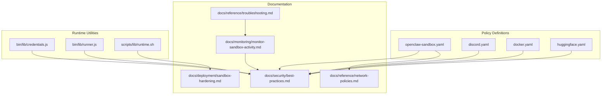
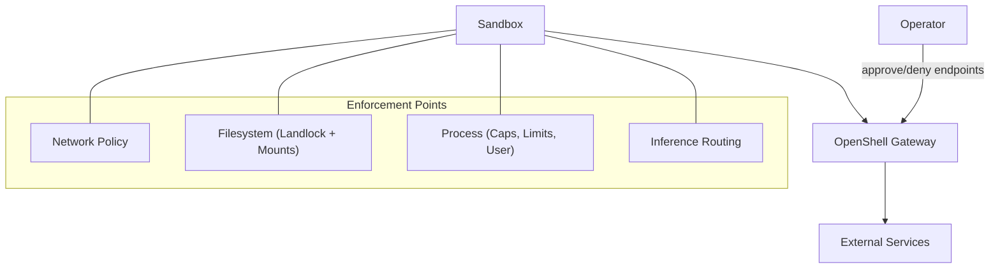
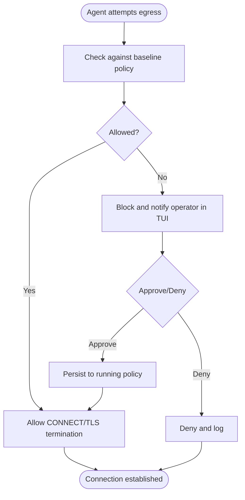
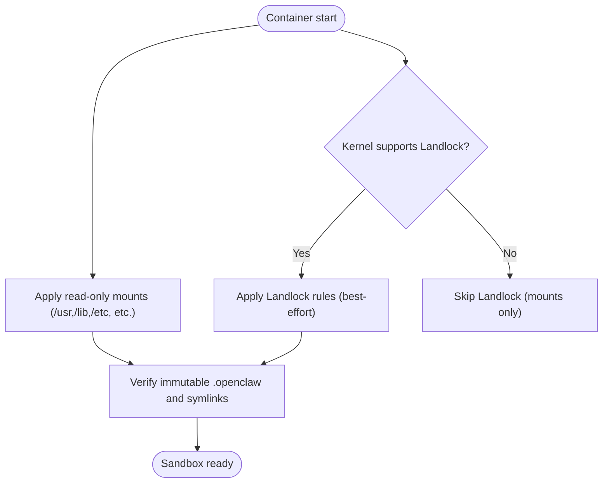
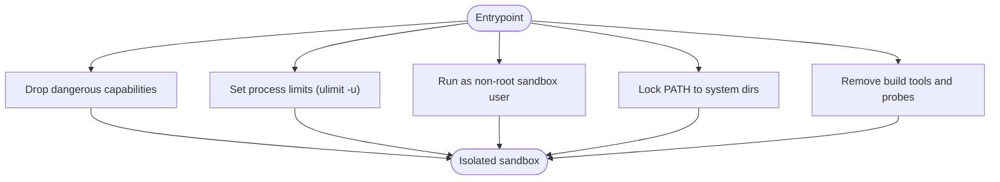
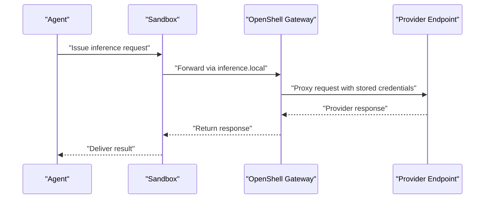
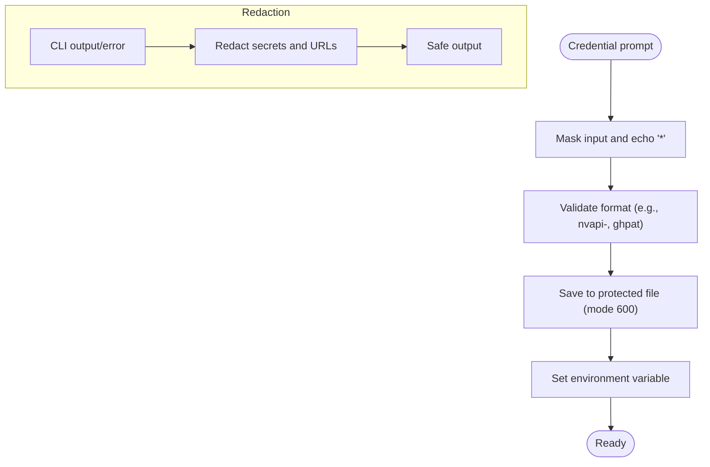
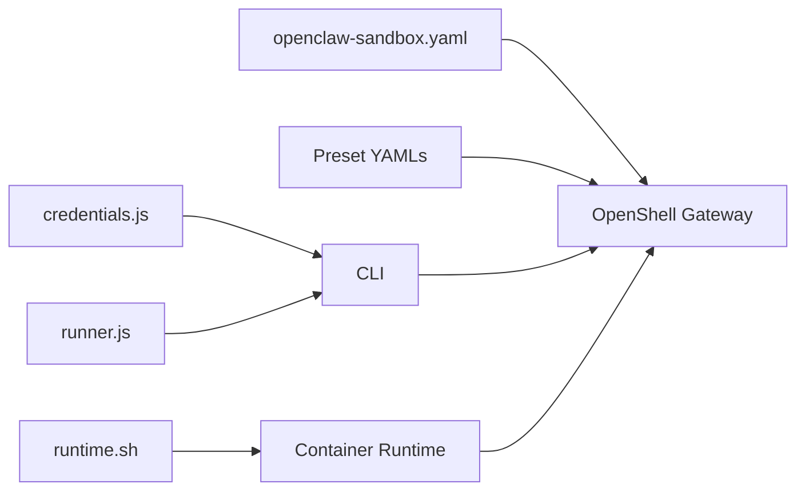

# Security Framework

<cite>
**Referenced Files in This Document**
- [SECURITY.md](file://SECURITY.md)
- [best-practices.md](file://docs/security/best-practices.md)
- [network-policies.md](file://docs/reference/network-policies.md)
- [sandbox-hardening.md](file://docs/deployment/sandbox-hardening.md)
- [openclaw-sandbox.yaml](file://nemoclaw-blueprint/policies/openclaw-sandbox.yaml)
- [discord.yaml](file://nemoclaw-blueprint/policies/presets/discord.yaml)
- [docker.yaml](file://nemoclaw-blueprint/policies/presets/docker.yaml)
- [huggingface.yaml](file://nemoclaw-blueprint/policies/presets/huggingface.yaml)
- [monitor-sandbox-activity.md](file://docs/monitoring/monitor-sandbox-activity.md)
- [troubleshooting.md](file://docs/reference/troubleshooting.md)
- [credentials.js](file://bin/lib/credentials.js)
- [runner.js](file://bin/lib/runner.js)
- [runtime.sh](file://scripts/lib/runtime.sh)
</cite>

## Table of Contents
1. [Introduction](#introduction)
2. [Project Structure](#project-structure)
3. [Core Components](#core-components)
4. [Architecture Overview](#architecture-overview)
5. [Detailed Component Analysis](#detailed-component-analysis)
6. [Dependency Analysis](#dependency-analysis)
7. [Performance Considerations](#performance-considerations)
8. [Troubleshooting Guide](#troubleshooting-guide)
9. [Conclusion](#conclusion)
10. [Appendices](#appendices)

## Introduction
This document describes NemoClaw’s multi-layered security architecture and protection mechanisms. It explains how the system enforces filesystem access control via Landlock LSM, process isolation through capability drops and resource limits, and network traffic separation using OpenShell gateway controls. It also documents network policy management (baseline rules, dynamic updates, operator approvals), credential protection strategies, posture profiles for different deployment scenarios, and operational guidance for monitoring, incident response, and compliance.

## Project Structure
Security-related assets are organized across:
- Policy definitions for network and filesystem controls
- Operational documentation for hardening and monitoring
- CLI and runtime utilities that redact secrets and manage credentials
- Scripts that support runtime detection and container orchestration

**Diagram sources**
- [openclaw-sandbox.yaml:1-219](file://nemoclaw-blueprint/policies/openclaw-sandbox.yaml#L1-L219)
- [discord.yaml:1-47](file://nemoclaw-blueprint/policies/presets/discord.yaml#L1-L47)
- [docker.yaml:1-46](file://nemoclaw-blueprint/policies/presets/docker.yaml#L1-L46)
- [huggingface.yaml:1-38](file://nemoclaw-blueprint/policies/presets/huggingface.yaml#L1-L38)
- [best-practices.md:1-510](file://docs/security/best-practices.md#L1-L510)
- [network-policies.md:1-145](file://docs/reference/network-policies.md#L1-L145)
- [sandbox-hardening.md:1-91](file://docs/deployment/sandbox-hardening.md#L1-L91)
- [monitor-sandbox-activity.md:1-102](file://docs/monitoring/monitor-sandbox-activity.md#L1-L102)
- [troubleshooting.md:1-277](file://docs/reference/troubleshooting.md#L1-L277)
- [credentials.js:1-328](file://bin/lib/credentials.js#L1-L328)
- [runner.js:1-207](file://bin/lib/runner.js#L1-L207)
- [runtime.sh:1-229](file://scripts/lib/runtime.sh#L1-L229)

**Section sources**
- [best-practices.md:1-510](file://docs/security/best-practices.md#L1-L510)
- [network-policies.md:1-145](file://docs/reference/network-policies.md#L1-L145)
- [sandbox-hardening.md:1-91](file://docs/deployment/sandbox-hardening.md#L1-L91)

## Core Components
- Network controls: deny-by-default egress, binary-scoped endpoint rules, path-scoped HTTP rules, L4-only vs L7 inspection, operator approval flow, and policy presets.
- Filesystem controls: read-only system paths, read-only immutable gateway config, writable paths, and Landlock LSM enforcement.
- Process controls: capability drops, gateway process isolation, no-new-privileges, process limits, non-root user, PATH hardening, and build toolchain removal.
- Inference controls: routed inference through the gateway to isolate provider credentials.
- Credential protection: secure storage, secret redaction in CLI output, and prompt handling.
- Monitoring and observability: TUI for network activity, logs, and troubleshooting guidance.

**Section sources**
- [best-practices.md:126-510](file://docs/security/best-practices.md#L126-L510)
- [network-policies.md:25-145](file://docs/reference/network-policies.md#L25-L145)
- [openclaw-sandbox.yaml:18-219](file://nemoclaw-blueprint/policies/openclaw-sandbox.yaml#L18-L219)
- [credentials.js:58-91](file://bin/lib/credentials.js#L58-L91)
- [runner.js:84-154](file://bin/lib/runner.js#L84-L154)

## Architecture Overview
NemoClaw enforces security across four layers: network, filesystem, process, and inference. The default posture is deny-by-default, with operators approving exceptions through the TUI and persistent policy updates.

**Diagram sources**
- [best-practices.md:38-125](file://docs/security/best-practices.md#L38-L125)
- [network-policies.md:25-127](file://docs/reference/network-policies.md#L25-L127)
- [openclaw-sandbox.yaml:18-45](file://nemoclaw-blueprint/policies/openclaw-sandbox.yaml#L18-L45)

## Detailed Component Analysis

### Network Policy Management
- Baseline rules define which hosts, ports, and HTTP methods are allowed by default. Operators can approve or deny requests in real time via the TUI.
- Dynamic policy application allows updating a running sandbox without restart using the OpenShell CLI.
- Policy presets enable common integrations with scoping rules for binaries and HTTP access.

**Diagram sources**
- [network-policies.md:110-127](file://docs/reference/network-policies.md#L110-L127)
- [openclaw-sandbox.yaml:46-219](file://nemoclaw-blueprint/policies/openclaw-sandbox.yaml#L46-L219)

**Section sources**
- [network-policies.md:29-145](file://docs/reference/network-policies.md#L29-L145)
- [openclaw-sandbox.yaml:46-219](file://nemoclaw-blueprint/policies/openclaw-sandbox.yaml#L46-L219)
- [discord.yaml:8-47](file://nemoclaw-blueprint/policies/presets/discord.yaml#L8-L47)
- [docker.yaml:8-46](file://nemoclaw-blueprint/policies/presets/docker.yaml#L8-L46)
- [huggingface.yaml:8-38](file://nemoclaw-blueprint/policies/presets/huggingface.yaml#L8-L38)

### Filesystem Access Control (Landlock LSM + Mounts)
- Read-only system paths and a read-only immutable gateway configuration directory protect critical system and gateway assets.
- Landlock LSM enforcement is applied when supported by the kernel; otherwise, container mount configuration serves as the primary defense.

**Diagram sources**
- [best-practices.md:258-268](file://docs/security/best-practices.md#L258-L268)
- [openclaw-sandbox.yaml:18-41](file://nemoclaw-blueprint/policies/openclaw-sandbox.yaml#L18-L41)

**Section sources**
- [best-practices.md:210-268](file://docs/security/best-practices.md#L210-L268)
- [openclaw-sandbox.yaml:18-41](file://nemoclaw-blueprint/policies/openclaw-sandbox.yaml#L18-L41)

### Process Isolation and Capability Drops
- Capability drops reduce the blast radius of any process by removing dangerous capabilities from the bounding set.
- Non-root user and process limits mitigate privilege escalation and fork-bomb risks.
- PATH hardening and build toolchain removal further constrain the sandbox’s attack surface.

**Diagram sources**
- [best-practices.md:269-362](file://docs/security/best-practices.md#L269-L362)
- [sandbox-hardening.md:28-57](file://docs/deployment/sandbox-hardening.md#L28-L57)

**Section sources**
- [best-practices.md:269-362](file://docs/security/best-practices.md#L269-L362)
- [sandbox-hardening.md:28-57](file://docs/deployment/sandbox-hardening.md#L28-L57)

### Inference Traffic Separation
- All inference requests are routed through the OpenShell gateway to isolate provider credentials from the sandbox and track usage centrally.

**Diagram sources**
- [best-practices.md:412-427](file://docs/security/best-practices.md#L412-L427)

**Section sources**
- [best-practices.md:412-427](file://docs/security/best-practices.md#L412-L427)

### Credential Protection Strategies
- Secure storage: credentials are persisted in a protected directory with restrictive permissions.
- Prompt handling: interactive secret prompts mask input and handle interruptions safely.
- Secret redaction: CLI redacts known secret patterns and authenticated URLs from logs and errors.

**Diagram sources**
- [credentials.js:75-91](file://bin/lib/credentials.js#L75-L91)
- [runner.js:84-154](file://bin/lib/runner.js#L84-L154)

**Section sources**
- [credentials.js:58-91](file://bin/lib/credentials.js#L58-L91)
- [runner.js:84-154](file://bin/lib/runner.js#L84-L154)

### Network Namespace Isolation
- OpenShell enforces network namespace isolation, SSRF protection, TLS auto-detection and termination, and audit-vs-enforce modes. These platform-level controls complement NemoClaw’s policy-driven enforcement.

**Section sources**
- [best-practices.md:31-36](file://docs/security/best-practices.md#L31-L36)

### Security Best Practices and Posture Profiles
- Locked-down posture: minimal external access, strict operator approval, and local inference.
- Development posture: targeted presets for package registries and development tools with binary restrictions.
- Integration testing posture: tight endpoint rules, L7 inspection, and ephemeral baselines.

**Section sources**
- [best-practices.md:454-487](file://docs/security/best-practices.md#L454-L487)

## Dependency Analysis
- Policy definitions drive enforcement at the gateway and sandbox boundaries.
- Runtime scripts assist in container orchestration and environment detection.
- CLI utilities provide secret handling and redaction for safe diagnostics.

**Diagram sources**
- [openclaw-sandbox.yaml:1-219](file://nemoclaw-blueprint/policies/openclaw-sandbox.yaml#L1-L219)
- [discord.yaml:1-47](file://nemoclaw-blueprint/policies/presets/discord.yaml#L1-L47)
- [docker.yaml:1-46](file://nemoclaw-blueprint/policies/presets/docker.yaml#L1-L46)
- [huggingface.yaml:1-38](file://nemoclaw-blueprint/policies/presets/huggingface.yaml#L1-L38)
- [credentials.js:1-328](file://bin/lib/credentials.js#L1-L328)
- [runner.js:1-207](file://bin/lib/runner.js#L1-L207)
- [runtime.sh:1-229](file://scripts/lib/runtime.sh#L1-L229)

**Section sources**
- [network-policies.md:128-145](file://docs/reference/network-policies.md#L128-L145)
- [sandbox-hardening.md:59-84](file://docs/deployment/sandbox-hardening.md#L59-L84)

## Performance Considerations
- Enforcing L7 inspection adds CPU overhead; use it selectively for REST APIs requiring method/path control.
- Tight binary restrictions reduce misuse but may require iterative approvals during development.
- Process limits prevent resource exhaustion; adjust cautiously based on workload characteristics.

[No sources needed since this section provides general guidance]

## Troubleshooting Guide
- Use the TUI to inspect blocked requests and approve/deny endpoints.
- Stream logs to diagnose blueprint and sandbox issues.
- For inference failures, verify provider reachability and active policy configuration.
- If the sandbox does not recover after a host reboot, recreate it using the onboard wizard.

**Section sources**
- [monitor-sandbox-activity.md:63-79](file://docs/monitoring/monitor-sandbox-activity.md#L63-L79)
- [troubleshooting.md:256-277](file://docs/reference/troubleshooting.md#L256-L277)

## Conclusion
NemoClaw’s security framework combines deny-by-default policies, kernel-level filesystem controls, process isolation, and centralized inference routing. Operators can tailor controls per scenario using posture profiles, dynamic policy updates, and preset configurations while maintaining strong protections against credential theft, unauthorized egress, and privilege escalation.

[No sources needed since this section summarizes without analyzing specific files]

## Appendices

### Practical Examples and Threat Modeling
- Example: Permit only specific binaries to reach a third-party API by scoping the endpoint to those binaries.
- Example: Enable L7 inspection for REST APIs to restrict HTTP methods and paths.
- Example: Use operator approval for one-off requests instead of permanently expanding the baseline policy.
- Example: Route inference through the gateway to prevent credential exposure and centralize cost control.

**Section sources**
- [best-practices.md:126-209](file://docs/security/best-practices.md#L126-L209)
- [network-policies.md:128-145](file://docs/reference/network-policies.md#L128-L145)

### Compliance and Enterprise Considerations
- Report vulnerabilities privately using the documented channels.
- Maintain audit trails via TUI monitoring and logs.
- Enforce container-level security options (no-new-privileges, capability drops) for hardened deployments.

**Section sources**
- [SECURITY.md:10-59](file://SECURITY.md#L10-L59)
- [sandbox-hardening.md:59-84](file://docs/deployment/sandbox-hardening.md#L59-L84)