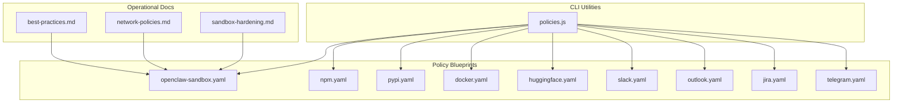
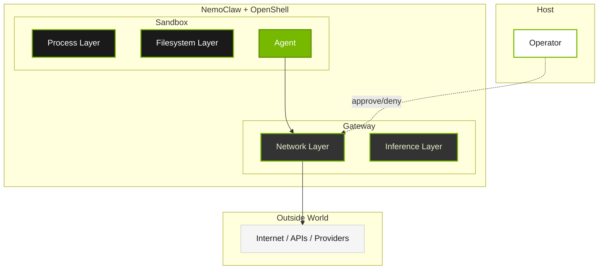
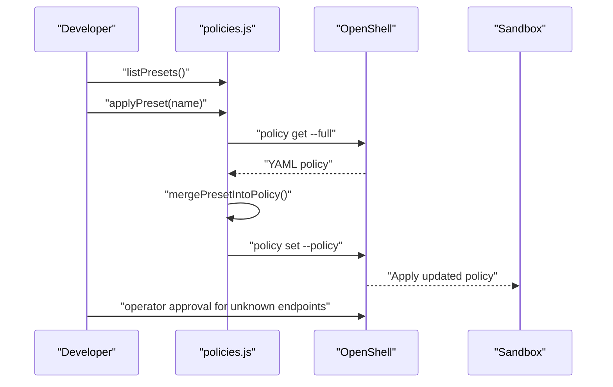
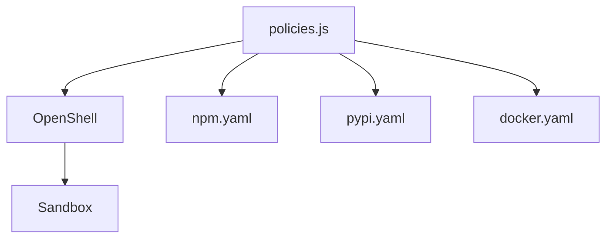

# Security Posture Profiles

<cite>
**Referenced Files in This Document**
- [openclaw-sandbox.yaml](file://nemoclaw-blueprint/policies/openclaw-sandbox.yaml)
- [best-practices.md](file://docs/security/best-practices.md)
- [network-policies.md](file://docs/reference/network-policies.md)
- [sandbox-hardening.md](file://docs/deployment/sandbox-hardening.md)
- [policies.js](file://bin/lib/policies.js)
- [npm.yaml](file://nemoclaw-blueprint/policies/presets/npm.yaml)
- [docker.yaml](file://nemoclaw-blueprint/policies/presets/docker.yaml)
- [pypi.yaml](file://nemoclaw-blueprint/policies/presets/pypi.yaml)
- [huggingface.yaml](file://nemoclaw-blueprint/policies/presets/huggingface.yaml)
- [slack.yaml](file://nemoclaw-blueprint/policies/presets/slack.yaml)
- [outlook.yaml](file://nemoclaw-blueprint/policies/presets/outlook.yaml)
- [jira.yaml](file://nemoclaw-blueprint/policies/presets/jira.yaml)
- [telegram.yaml](file://nemoclaw-blueprint/policies/presets/telegram.yaml)
</cite>

## Table of Contents
1. [Introduction](#introduction)
2. [Project Structure](#project-structure)
3. [Core Components](#core-components)
4. [Architecture Overview](#architecture-overview)
5. [Detailed Component Analysis](#detailed-component-analysis)
6. [Dependency Analysis](#dependency-analysis)
7. [Performance Considerations](#performance-considerations)
8. [Troubleshooting Guide](#troubleshooting-guide)
9. [Conclusion](#conclusion)
10. [Appendices](#appendices)

## Introduction
This document defines configurable security posture profiles for NemoClaw, explaining how to lock down the system for always-on assistants, enable development workflows, and safely operate integration tests. It also provides guidance for creating custom security profiles, balancing security versus functionality, and selecting appropriate postures across environments. The content is grounded in the repository’s policy blueprints, CLI helpers, and operational documentation.

## Project Structure
NemoClaw’s security posture is primarily defined by:
- A deny-by-default sandbox policy blueprint
- Preset policy bundles for common integrations
- CLI utilities to list, load, merge, and apply presets
- Operational guides for network policies, approvals, and hardening

**Diagram sources**
- [openclaw-sandbox.yaml:1-219](file://nemoclaw-blueprint/policies/openclaw-sandbox.yaml#L1-L219)
- [policies.js:1-353](file://bin/lib/policies.js#L1-L353)
- [best-practices.md:454-487](file://docs/security/best-practices.md#L454-L487)
- [network-policies.md:23-145](file://docs/reference/network-policies.md#L23-L145)
- [sandbox-hardening.md:23-91](file://docs/deployment/sandbox-hardening.md#L23-L91)
- [npm.yaml:1-25](file://nemoclaw-blueprint/policies/presets/npm.yaml#L1-L25)
- [docker.yaml:1-46](file://nemoclaw-blueprint/policies/presets/docker.yaml#L1-L46)
- [pypi.yaml:1-27](file://nemoclaw-blueprint/policies/presets/pypi.yaml#L1-L27)
- [huggingface.yaml:1-38](file://nemoclaw-blueprint/policies/presets/huggingface.yaml#L1-L38)
- [slack.yaml:1-46](file://nemoclaw-blueprint/policies/presets/slack.yaml#L1-L46)
- [outlook.yaml:1-46](file://nemoclaw-blueprint/policies/presets/outlook.yaml#L1-L46)
- [jira.yaml:1-38](file://nemoclaw-blueprint/policies/presets/jira.yaml#L1-L38)
- [telegram.yaml:1-23](file://nemoclaw-blueprint/policies/presets/telegram.yaml#L1-L23)

**Section sources**
- [openclaw-sandbox.yaml:1-219](file://nemoclaw-blueprint/policies/openclaw-sandbox.yaml#L1-L219)
- [policies.js:1-353](file://bin/lib/policies.js#L1-L353)
- [best-practices.md:454-487](file://docs/security/best-practices.md#L454-L487)
- [network-policies.md:23-145](file://docs/reference/network-policies.md#L23-L145)
- [sandbox-hardening.md:23-91](file://docs/deployment/sandbox-hardening.md#L23-L91)

## Core Components
- Deny-by-default sandbox policy: Defines baseline filesystem, process, and network controls; blocks all outbound unless explicitly allowed.
- Policy presets: Predefined network policy bundles for common integrations (e.g., npm, pypi, docker, huggingface, slack, outlook, jira, telegram).
- CLI policy manager: Lists presets, loads and merges them into the current policy, and applies them to a running sandbox.
- Operational guides: Describe how to approve/deny endpoints, customize policies, and harden containers.

Key posture profiles:
- Locked-Down (default): Minimal external access; rely on operator approval for exceptions.
- Development: Apply presets for package registries and container registries; maintain binary scoping.
- Integration Testing: Add custom endpoints with strict method/path rules; use operator approval for unknown destinations; clean up afterward.

**Section sources**
- [openclaw-sandbox.yaml:16-219](file://nemoclaw-blueprint/policies/openclaw-sandbox.yaml#L16-L219)
- [best-practices.md:454-487](file://docs/security/best-practices.md#L454-L487)
- [policies.js:21-353](file://bin/lib/policies.js#L21-L353)
- [network-policies.md:23-145](file://docs/reference/network-policies.md#L23-L145)

## Architecture Overview
The security architecture enforces controls across four layers: network, filesystem, process, and inference. Operators can tune dynamic controls at runtime while static controls require sandbox recreation.

**Diagram sources**
- [best-practices.md:46-93](file://docs/security/best-practices.md#L46-L93)

## Detailed Component Analysis

### Locked-Down (Default) Posture
- Keep all defaults; do not add presets.
- Use operator approval for any endpoint the agent requests.
- Prefer NVIDIA Endpoints or local Ollama for inference.
- Monitor the TUI for unexpected network requests.

Practical example:
- Start with the baseline policy and approve only the endpoints needed for the assistant’s tasks.
- Avoid permanently widening the baseline; rely on approvals for temporary access.

Trade-offs:
- Security: Highest protection against data exfiltration and unauthorized provider access.
- Functionality: Minimal external access; frequent approvals for new endpoints.

Risk assessment:
- Evaluate each approved endpoint for least privilege (method/path scoping) and confirm necessity.

Decision framework:
- If the assistant must reach a new host, approve temporarily and revisit after the task completes.

**Section sources**
- [best-practices.md:460-468](file://docs/security/best-practices.md#L460-L468)
- [network-policies.md:23-145](file://docs/reference/network-policies.md#L23-L145)

### Development Posture
- Apply presets for package registries and container registries as needed:
  - npm/pypi for package installs
  - docker for pulling/building container images
- Keep binary restrictions on all presets.
- Periodically review network activity with the terminal interface.
- Use operator approval for endpoints not covered by presets.

Practical example:
- Apply the npm preset, then approve only the specific registry endpoints required for a build.
- After building, remove the approval and revert to locked-down posture.

Trade-offs:
- Security: Slightly relaxed to enable development tasks.
- Functionality: Enables package and container workflows with scoping.

Risk assessment:
- Verify that binary scopes match the agent’s actual usage.
- Confirm that only necessary endpoints are approved.

Decision framework:
- Use presets for standard tasks; add custom endpoints only when presets do not apply.

**Section sources**
- [best-practices.md:469-478](file://docs/security/best-practices.md#L469-L478)
- [npm.yaml:1-25](file://nemoclaw-blueprint/policies/presets/npm.yaml#L1-L25)
- [pypi.yaml:1-27](file://nemoclaw-blueprint/policies/presets/pypi.yaml#L1-L27)
- [docker.yaml:1-46](file://nemoclaw-blueprint/policies/presets/docker.yaml#L1-L46)

### Integration Testing Posture
- Add custom endpoint entries with tight path and method restrictions.
- Use REST inspection for HTTP APIs to maintain per-request filtering.
- Use operator approval for unknown endpoints during test runs.
- Review and clean up the baseline policy after testing; remove endpoints that are no longer needed.

Practical example:
- For an internal API, define a single endpoint with GET-only and a narrow path prefix.
- After testing, remove the endpoint from the policy to minimize future risk.

Trade-offs:
- Security: Moderate; intentional relaxation for testing with strict controls.
- Functionality: Enables targeted testing with minimal blast radius.

Risk assessment:
- Ensure protocol-level inspection is enabled for HTTP endpoints.
- Confirm binary scopes and path rules align with the test scope.

Decision framework:
- Prefer operator approval for ad-hoc testing; formalize endpoints only if reuse is likely.

**Section sources**
- [best-practices.md:479-487](file://docs/security/best-practices.md#L479-L487)
- [network-policies.md:128-145](file://docs/reference/network-policies.md#L128-L145)

### Creating Custom Security Profiles
Guidance:
- Define custom endpoints with explicit methods and paths.
- Scope binaries to the minimum required executables.
- Enable REST inspection for HTTP APIs.
- Use operator approval for unknown destinations during evaluation.

Implementation steps:
- Use the CLI to fetch the current policy, merge custom endpoints, and apply to the sandbox.

**Diagram sources**
- [policies.js:220-285](file://bin/lib/policies.js#L220-L285)
- [network-policies.md:138-145](file://docs/reference/network-policies.md#L138-L145)

**Section sources**
- [policies.js:21-353](file://bin/lib/policies.js#L21-L353)
- [network-policies.md:128-145](file://docs/reference/network-policies.md#L128-L145)

### Preset Reference and Risk Profiles
Common presets and their risks:
- npm/yarn: Allows installing arbitrary packages; scope binaries to package managers.
- docker: Allows pulling arbitrary images; scope binaries to Docker.
- huggingface: Allows downloading models/datasets; scope binaries to Python/Node.
- slack: WebSocket requires full access; scope binaries to Node.
- outlook: Grants email access; scope binaries to Node.
- jira: Grants issue/comment access; scope binaries to Node.
- telegram: Bot API access; scope binaries to Node.

Recommendation:
- Apply presets only when the agent’s task requires them; review YAML to understand endpoints, methods, and binary restrictions.

**Section sources**
- [best-practices.md:192-209](file://docs/security/best-practices.md#L192-L209)
- [npm.yaml:1-25](file://nemoclaw-blueprint/policies/presets/npm.yaml#L1-L25)
- [docker.yaml:1-46](file://nemoclaw-blueprint/policies/presets/docker.yaml#L1-L46)
- [huggingface.yaml:1-38](file://nemoclaw-blueprint/policies/presets/huggingface.yaml#L1-L38)
- [slack.yaml:1-46](file://nemoclaw-blueprint/policies/presets/slack.yaml#L1-L46)
- [outlook.yaml:1-46](file://nemoclaw-blueprint/policies/presets/outlook.yaml#L1-L46)
- [jira.yaml:1-38](file://nemoclaw-blueprint/policies/presets/jira.yaml#L1-L38)
- [telegram.yaml:1-23](file://nemoclaw-blueprint/policies/presets/telegram.yaml#L1-L23)

## Dependency Analysis
Policy presets are loaded and merged into the current sandbox policy via the CLI, which interacts with OpenShell to apply changes.

**Diagram sources**
- [policies.js:21-353](file://bin/lib/policies.js#L21-L353)
- [npm.yaml:1-25](file://nemoclaw-blueprint/policies/presets/npm.yaml#L1-L25)
- [pypi.yaml:1-27](file://nemoclaw-blueprint/policies/presets/pypi.yaml#L1-L27)
- [docker.yaml:1-46](file://nemoclaw-blueprint/policies/presets/docker.yaml#L1-L46)

**Section sources**
- [policies.js:21-353](file://bin/lib/policies.js#L21-L353)

## Performance Considerations
- Operator approval flow introduces interactive overhead; batch approvals for repetitive tasks.
- REST inspection adds CPU overhead compared to L4-only enforcement; use it where method/path control is essential.
- Binary scoping prevents misuse but requires accurate path matching; avoid overly broad globs.

[No sources needed since this section provides general guidance]

## Troubleshooting Guide
Common mistakes and remediation:
- Omitting REST inspection on HTTP endpoints: Add REST inspection with explicit rules.
- Permanently widening baseline for one-off requests: Use operator approval instead; approved endpoints reset when recreating the sandbox.
- Relying solely on entrypoint capability drops: Add runtime capability dropping for defense-in-depth.
- Granting write access to gateway config: Store agent-writable state in the designated writable area.
- Adding inference provider hosts to the network policy: Use OpenShell inference routing instead.
- Disabling device auth for remote deployments: Keep device auth enabled; only disable for local headless environments.

**Section sources**
- [best-practices.md:488-500](file://docs/security/best-practices.md#L488-L500)

## Conclusion
Selecting the right security posture depends on the deployment scenario and risk tolerance. Locked-down posture is ideal for always-on assistants; development posture enables necessary workflows with strict scoping; integration testing posture balances flexibility with strong controls. Use presets judiciously, apply REST inspection for HTTP APIs, scope binaries, and leverage operator approvals for dynamic adjustments. Regular reviews and cleanup of test endpoints help maintain a strong security posture across environments.

[No sources needed since this section summarizes without analyzing specific files]

## Appendices

### Decision Framework for Posture Selection
- Assess mission-criticality and sensitivity of data handled by the assistant.
- Determine required integrations and choose presets accordingly.
- Enforce REST inspection for HTTP APIs; scope binaries and paths tightly.
- Use operator approval for unknown endpoints during evaluation.
- Transition between postures by adjusting presets and approvals; clean up test endpoints afterward.

**Section sources**
- [best-practices.md:454-487](file://docs/security/best-practices.md#L454-L487)
- [network-policies.md:128-145](file://docs/reference/network-policies.md#L128-L145)