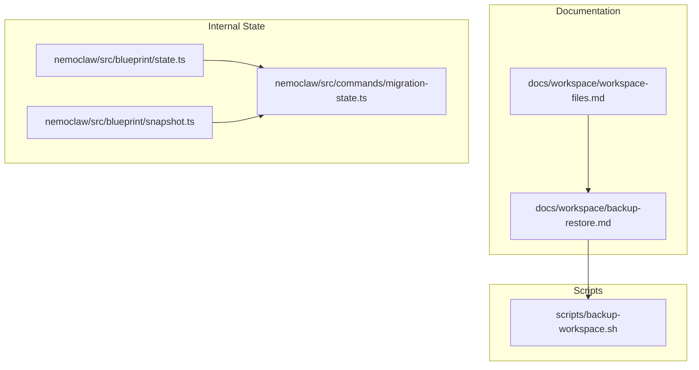
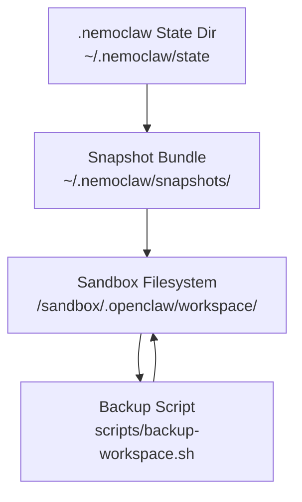
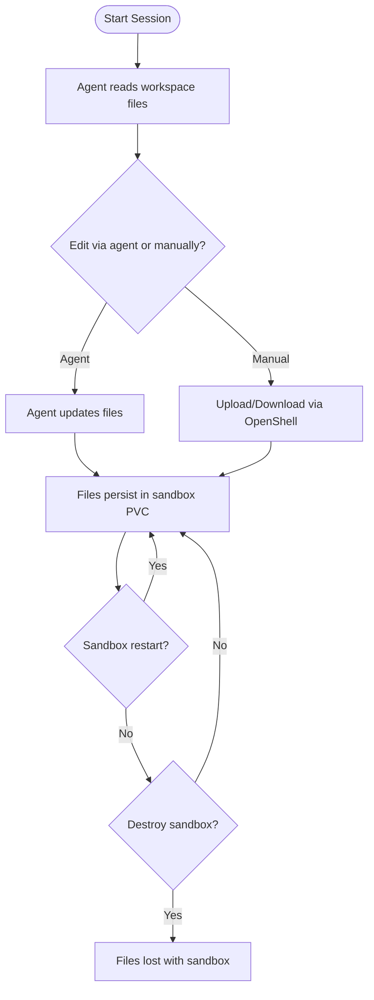
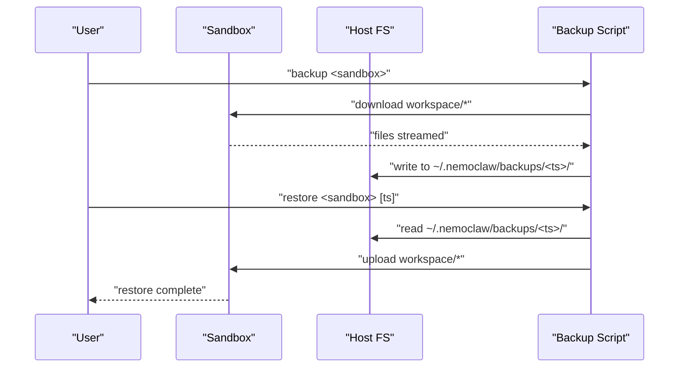
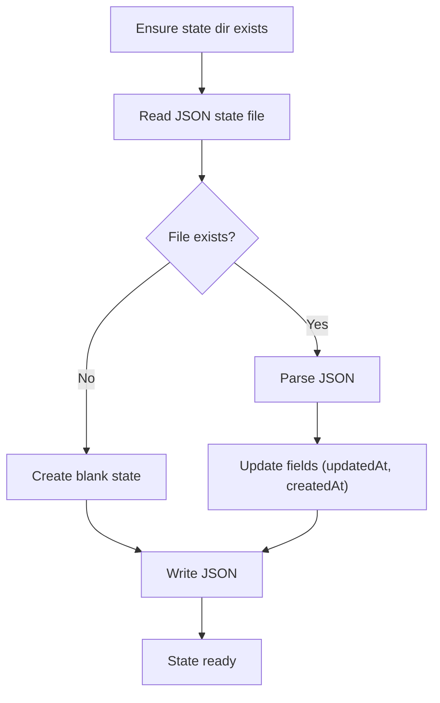
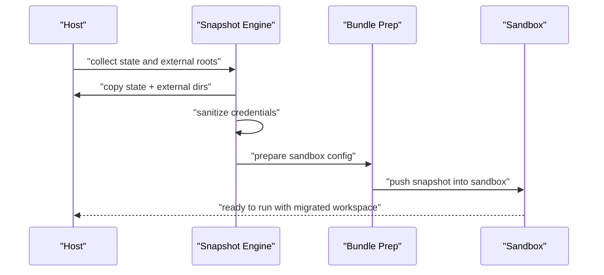
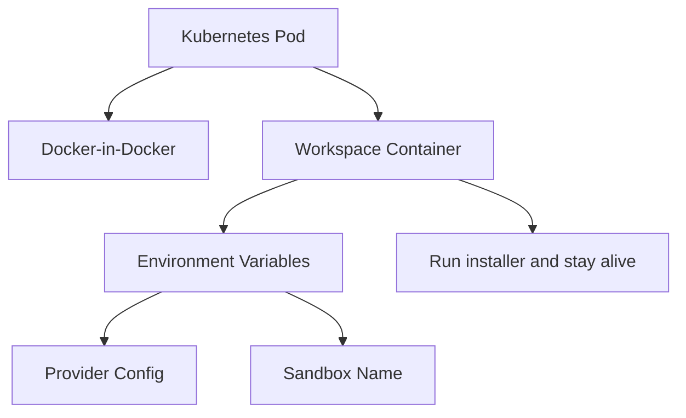
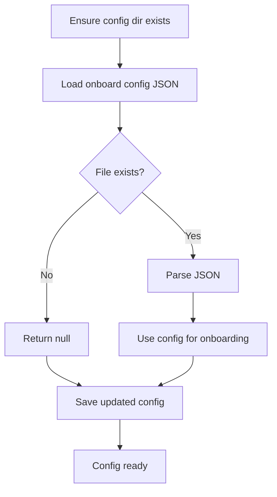
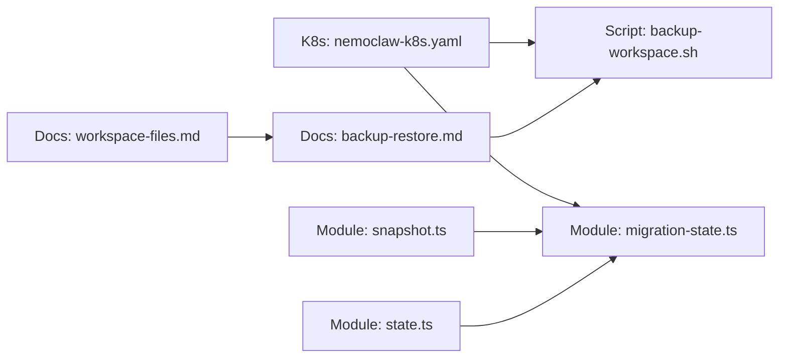

# Workspace Management

<cite>
**Referenced Files in This Document**
- [workspace-files.md](file://docs/workspace/workspace-files.md)
- [backup-restore.md](file://docs/workspace/backup-restore.md)
- [backup-workspace.sh](file://scripts/backup-workspace.sh)
- [state.ts](file://nemoclaw/src/blueprint/state.ts)
- [snapshot.ts](file://nemoclaw/src/blueprint/snapshot.ts)
- [migration-state.ts](file://nemoclaw/src/commands/migration-state.ts)
- [nemoclaw-k8s.yaml](file://k8s/nemoclaw-k8s.yaml)
- [config.ts](file://nemoclaw/src/onboard/config.ts)
</cite>

## Table of Contents
1. [Introduction](#introduction)
2. [Project Structure](#project-structure)
3. [Core Components](#core-components)
4. [Architecture Overview](#architecture-overview)
5. [Detailed Component Analysis](#detailed-component-analysis)
6. [Dependency Analysis](#dependency-analysis)
7. [Performance Considerations](#performance-considerations)
8. [Troubleshooting Guide](#troubleshooting-guide)
9. [Conclusion](#conclusion)
10. [Appendices](#appendices)

## Introduction
This document explains NemoClaw’s workspace management capabilities with a focus on persistent storage and state handling. It covers:
- Where workspace files live and how they persist across sandbox restarts
- How to back up and restore workspace data
- Environment setup and configuration directories
- File management within sandboxes
- Workspace migration between hosts
- Security and retention considerations

## Project Structure
Workspace management spans documentation, scripts, and internal state management modules:
- Documentation defines workspace file semantics and persistence behavior
- Backup scripts automate safe copying to and from sandboxes
- Internal modules manage host-side state and snapshot/restore flows for migration

**Diagram sources**
- [workspace-files.md:23-88](file://docs/workspace/workspace-files.md#L23-L88)
- [backup-restore.md:23-129](file://docs/workspace/backup-restore.md#L23-L129)
- [backup-workspace.sh:1-135](file://scripts/backup-workspace.sh#L1-L135)
- [state.ts:1-70](file://nemoclaw/src/blueprint/state.ts#L1-L70)
- [snapshot.ts:1-177](file://nemoclaw/src/blueprint/snapshot.ts#L1-L177)
- [migration-state.ts:1-912](file://nemoclaw/src/commands/migration-state.ts#L1-L912)

**Section sources**
- [workspace-files.md:23-88](file://docs/workspace/workspace-files.md#L23-L88)
- [backup-restore.md:23-129](file://docs/workspace/backup-restore.md#L23-L129)
- [backup-workspace.sh:1-135](file://scripts/backup-workspace.sh#L1-L135)
- [state.ts:1-70](file://nemoclaw/src/blueprint/state.ts#L1-L70)
- [snapshot.ts:1-177](file://nemoclaw/src/blueprint/snapshot.ts#L1-L177)
- [migration-state.ts:1-912](file://nemoclaw/src/commands/migration-state.ts#L1-L912)

## Core Components
- Workspace files: Markdown-based identity, behavior, and memory stored under the sandbox’s hidden workspace directory
- Backup and restore: Manual CLI steps and an automated script for safe offloading and restoration
- Host state: Local JSON state persisted under the user’s home directory for NemoClaw metadata
- Snapshots and migration: Full snapshot/restore flows for migrating host OpenClaw state into sandboxes and managing external roots

**Section sources**
- [workspace-files.md:25-88](file://docs/workspace/workspace-files.md#L25-L88)
- [backup-restore.md:25-129](file://docs/workspace/backup-restore.md#L25-L129)
- [backup-workspace.sh:7-11](file://scripts/backup-workspace.sh#L7-L11)
- [state.ts:7-61](file://nemoclaw/src/blueprint/state.ts#L7-L61)
- [snapshot.ts:29-79](file://nemoclaw/src/blueprint/snapshot.ts#L29-L79)
- [migration-state.ts:44-80](file://nemoclaw/src/commands/migration-state.ts#L44-L80)

## Architecture Overview
The workspace lifecycle integrates sandboxed persistence, host-side state, and migration utilities.

**Diagram sources**
- [workspace-files.md:45-55](file://docs/workspace/workspace-files.md#L45-L55)
- [backup-workspace.sh:7-11](file://scripts/backup-workspace.sh#L7-L11)
- [state.ts:7-32](file://nemoclaw/src/blueprint/state.ts#L7-L32)
- [snapshot.ts:32-79](file://nemoclaw/src/blueprint/snapshot.ts#L32-L79)
- [migration-state.ts:670-743](file://nemoclaw/src/commands/migration-state.ts#L670-L743)

## Detailed Component Analysis

### Workspace Files and Persistence
- Location: Hidden workspace directory inside the sandbox
- Files: Identity, behavior, memory, and daily notes
- Persistence: Preserved across sandbox restarts; destroyed when the sandbox is destroyed

**Diagram sources**
- [workspace-files.md:25-88](file://docs/workspace/workspace-files.md#L25-L88)

**Section sources**
- [workspace-files.md:25-88](file://docs/workspace/workspace-files.md#L25-L88)

### Backup and Restore Procedures
- Manual backup: Download individual files and directories from the sandbox to a timestamped host directory
- Manual restore: Upload files back into the sandbox
- Automated script: Provides backup and restore commands with secure permissions and error handling

**Diagram sources**
- [backup-restore.md:42-113](file://docs/workspace/backup-restore.md#L42-L113)
- [backup-workspace.sh:40-119](file://scripts/backup-workspace.sh#L40-L119)

**Section sources**
- [backup-restore.md:25-129](file://docs/workspace/backup-restore.md#L25-L129)
- [backup-workspace.sh:40-119](file://scripts/backup-workspace.sh#L40-L119)

### Host State Management
- Purpose: Persist lightweight NemoClaw metadata (last run, blueprint version, migration snapshot, host backup path)
- Storage: JSON file under the user’s home directory in a dedicated state directory
- Operations: Load, save, clear state with automatic directory creation

**Diagram sources**
- [state.ts:22-61](file://nemoclaw/src/blueprint/state.ts#L22-L61)

**Section sources**
- [state.ts:7-61](file://nemoclaw/src/blueprint/state.ts#L7-L61)

### Snapshot and Migration Utilities
- Snapshots capture host OpenClaw state and external roots, sanitize credentials, and prepare a sandbox-ready bundle
- Migration supports moving host configuration and workspaces into sandboxes, with rollback support

**Diagram sources**
- [snapshot.ts:57-96](file://nemoclaw/src/blueprint/snapshot.ts#L57-L96)
- [migration-state.ts:670-743](file://nemoclaw/src/commands/migration-state.ts#L670-L743)

**Section sources**
- [snapshot.ts:29-177](file://nemoclaw/src/blueprint/snapshot.ts#L29-L177)
- [migration-state.ts:44-80](file://nemoclaw/src/commands/migration-state.ts#L44-L80)

### Environment Setup and Sandboxes
- Kubernetes deployment installs NemoClaw and starts a containerized workspace; environment variables configure provider, endpoint, and sandbox name
- The workspace container runs the official installer and keeps the pod alive after onboarding

**Diagram sources**
- [nemoclaw-k8s.yaml:12-120](file://k8s/nemoclaw-k8s.yaml#L12-L120)

**Section sources**
- [nemoclaw-k8s.yaml:1-120](file://k8s/nemoclaw-k8s.yaml#L1-L120)

### Onboarding Configuration
- Stores endpoint type, URL, model, profile, and credential environment variable
- Persists to a JSON file under the NemoClaw config directory with secure creation and access

**Diagram sources**
- [config.ts:72-110](file://nemoclaw/src/onboard/config.ts#L72-L110)

**Section sources**
- [config.ts:21-110](file://nemoclaw/src/onboard/config.ts#L21-L110)

## Dependency Analysis
- Workspace documentation informs backup/restore scripts and migration logic
- Backup scripts depend on OpenShell CLI for sandbox operations
- Migration utilities depend on host state and configuration resolution
- Kubernetes deployment provides a sandboxed environment for workspace operations

**Diagram sources**
- [workspace-files.md:23-88](file://docs/workspace/workspace-files.md#L23-L88)
- [backup-restore.md:23-129](file://docs/workspace/backup-restore.md#L23-L129)
- [backup-workspace.sh:1-135](file://scripts/backup-workspace.sh#L1-L135)
- [state.ts:1-70](file://nemoclaw/src/blueprint/state.ts#L1-L70)
- [snapshot.ts:1-177](file://nemoclaw/src/blueprint/snapshot.ts#L1-L177)
- [migration-state.ts:1-912](file://nemoclaw/src/commands/migration-state.ts#L1-L912)
- [nemoclaw-k8s.yaml:1-120](file://k8s/nemoclaw-k8s.yaml#L1-L120)

**Section sources**
- [workspace-files.md:23-88](file://docs/workspace/workspace-files.md#L23-L88)
- [backup-restore.md:23-129](file://docs/workspace/backup-restore.md#L23-L129)
- [backup-workspace.sh:1-135](file://scripts/backup-workspace.sh#L1-L135)
- [state.ts:1-70](file://nemoclaw/src/blueprint/state.ts#L1-L70)
- [snapshot.ts:1-177](file://nemoclaw/src/blueprint/snapshot.ts#L1-L177)
- [migration-state.ts:1-912](file://nemoclaw/src/commands/migration-state.ts#L1-L912)
- [nemoclaw-k8s.yaml:1-120](file://k8s/nemoclaw-k8s.yaml#L1-L120)

## Performance Considerations
- Prefer incremental backups only for changed files when extending automation
- Use tar archives for large workspace directories to reduce per-file overhead during migration
- Limit symlink traversal by avoiding deeply nested symbolic links in workspace roots
- Schedule backups during off-peak hours to minimize impact on sandbox performance

## Troubleshooting Guide
Common issues and resolutions:
- No files backed up: Verify sandbox name and that workspace files exist; ensure OpenShell CLI is installed and reachable
- Restore fails: Confirm the sandbox is running and the backup directory exists; check permissions on the backup directory
- Credentials exposure risk: Rely on migration utilities’ credential sanitization; avoid committing secrets to workspace files
- Migration target validation: Ensure snapshot manifest homeDir and stateDir are within trusted host root before restoring

**Section sources**
- [backup-workspace.sh:71-118](file://scripts/backup-workspace.sh#L71-L118)
- [migration-state.ts:772-800](file://nemoclaw/src/commands/migration-state.ts#L772-L800)

## Conclusion
NemoClaw’s workspace management combines sandboxed persistence, robust backup/restore tooling, and secure migration utilities. By understanding where workspace files live, how to back them up, and how to migrate state across environments, teams can maintain reliable, auditable, and recoverable AI agent configurations.

## Appendices

### Practical Examples
- Back up workspace before destructive operations:
  - Use the automated script to create a timestamped backup
  - Verify backup contents locally
- Restore workspace after sandbox recreation:
  - Use the automated script to restore from the most recent or a specific timestamp
- Schedule periodic backups:
  - Integrate the backup script into cron or CI jobs
- Disaster recovery:
  - Use migration utilities to rebuild sandbox state from a snapshot bundle
  - Validate snapshot manifest and restore into a fresh sandbox

### Security and Access Control
- Restrict access to the host state directory and backups
- Sanitize credentials during snapshot creation and restore
- Avoid embedding secrets in workspace files; rely on provider credential mechanisms

### Data Retention Policies
- Define retention windows for backups and snapshots
- Archive older backups periodically and prune expired ones
- Maintain audit logs of backup/restore events